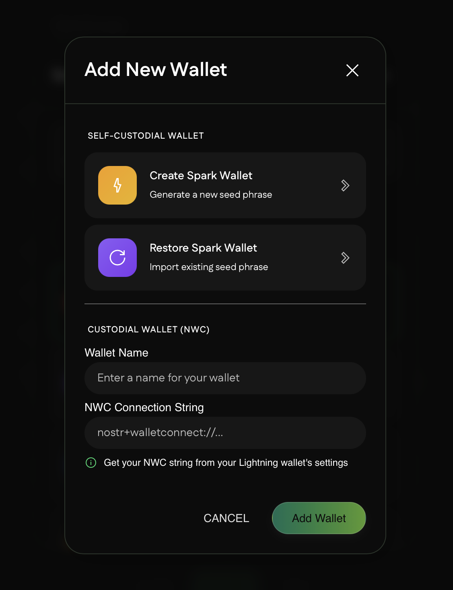
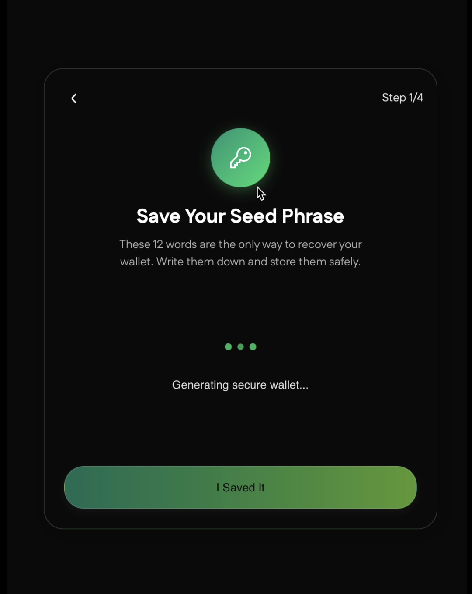
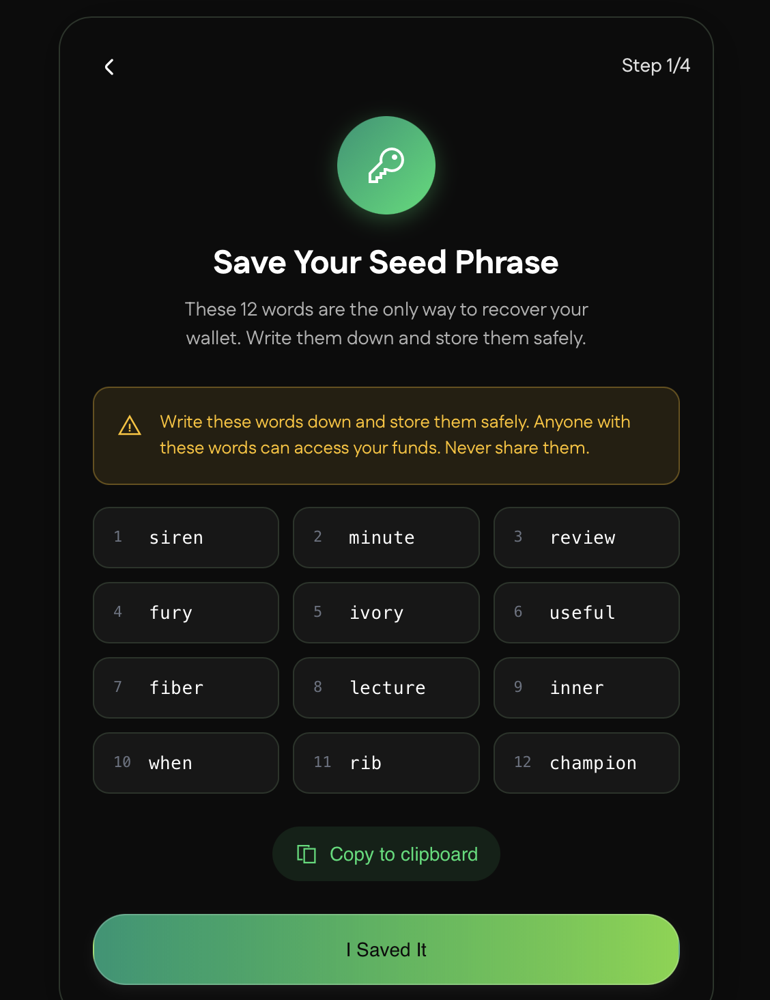
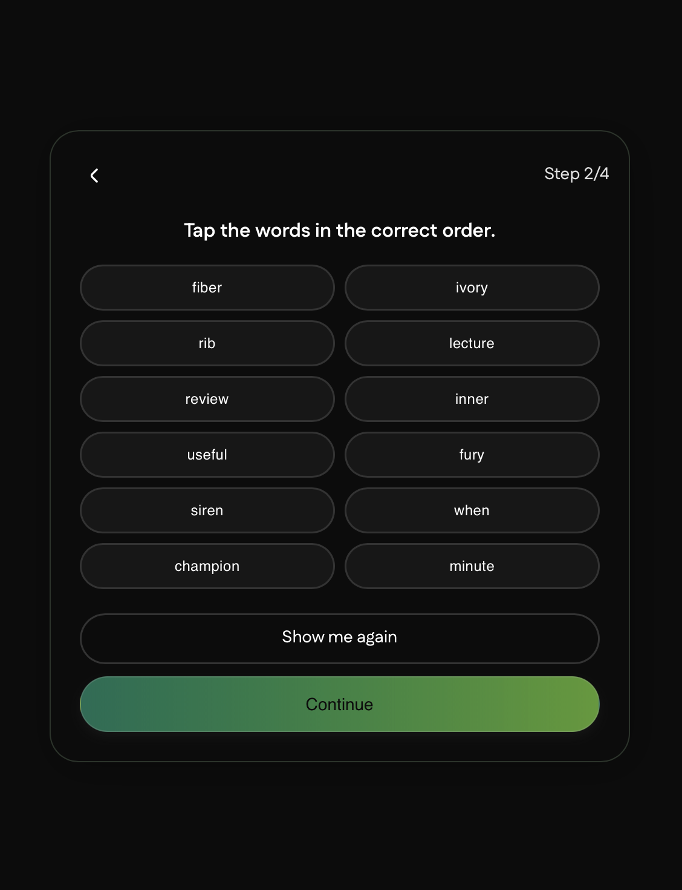
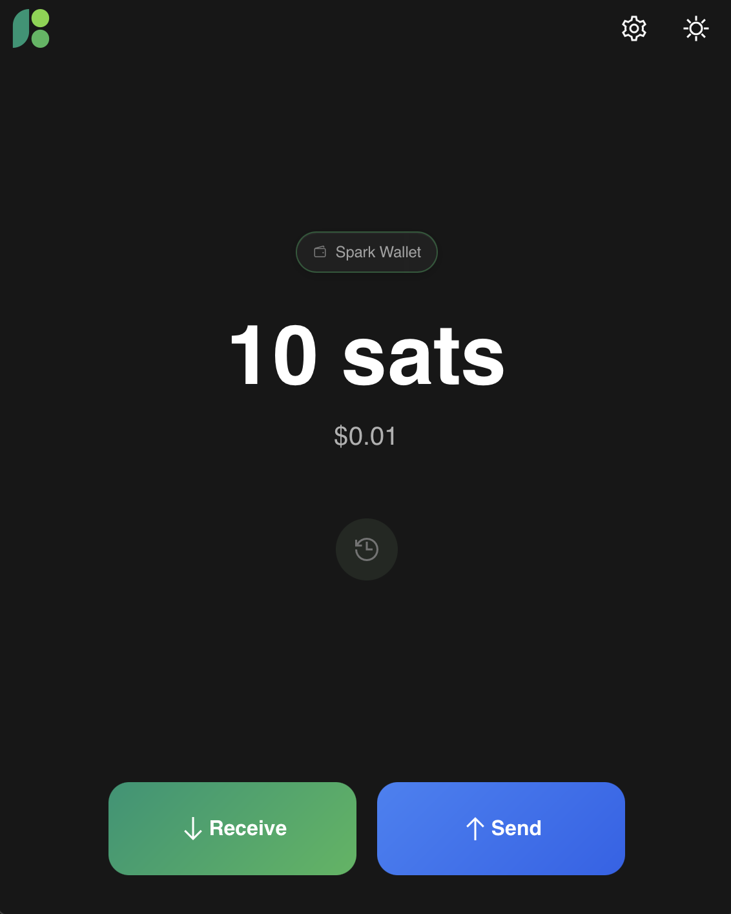
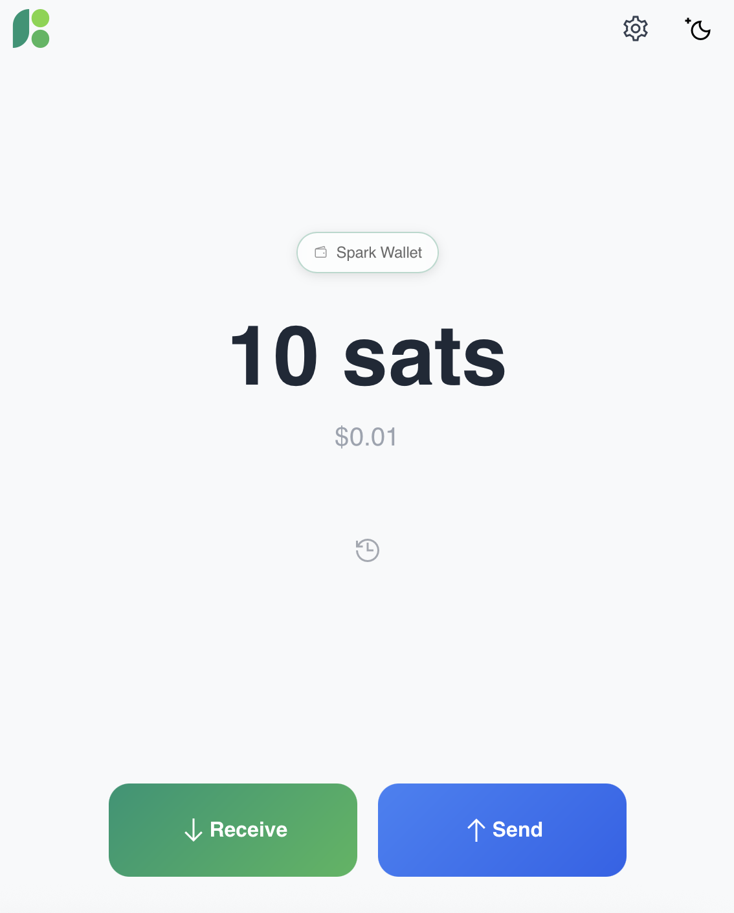
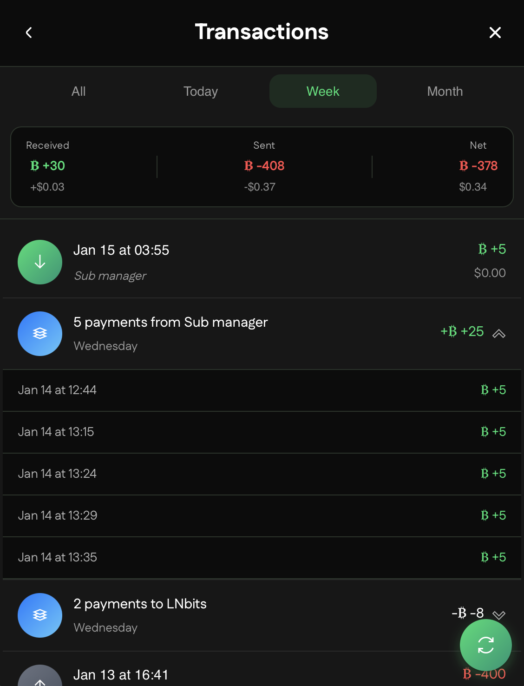
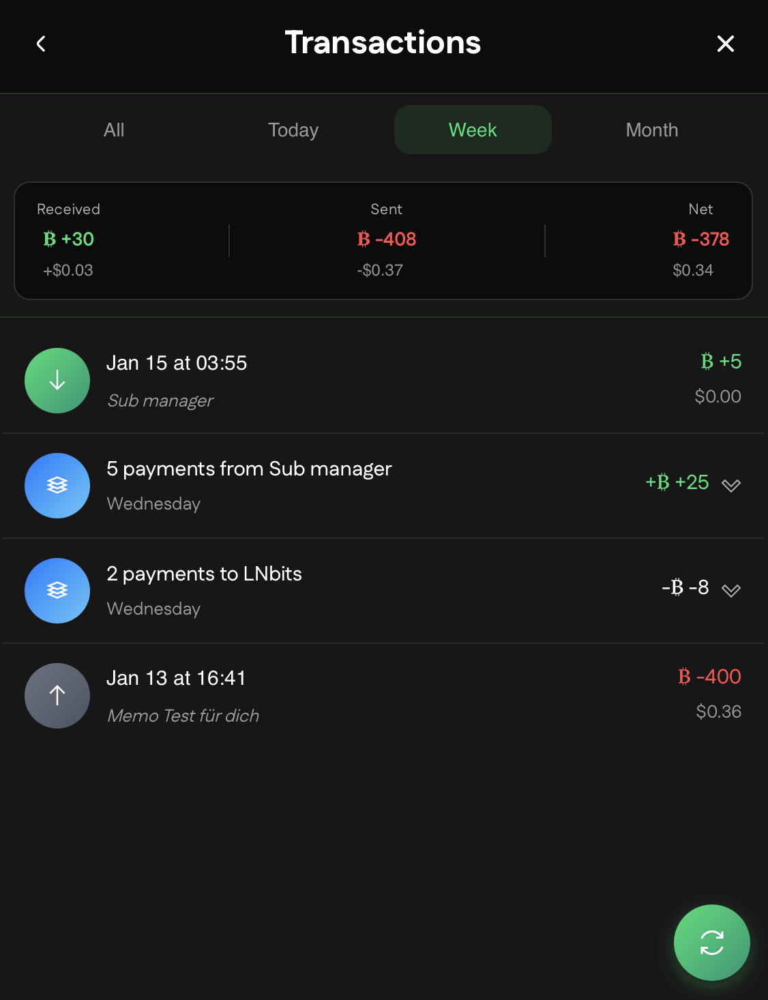
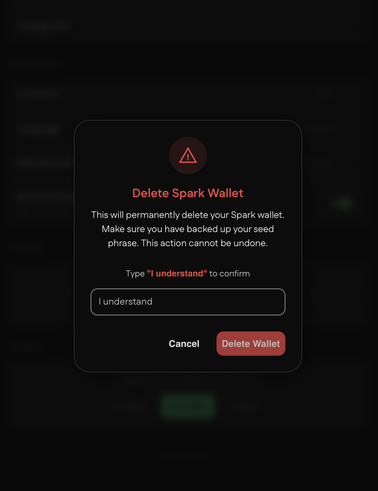
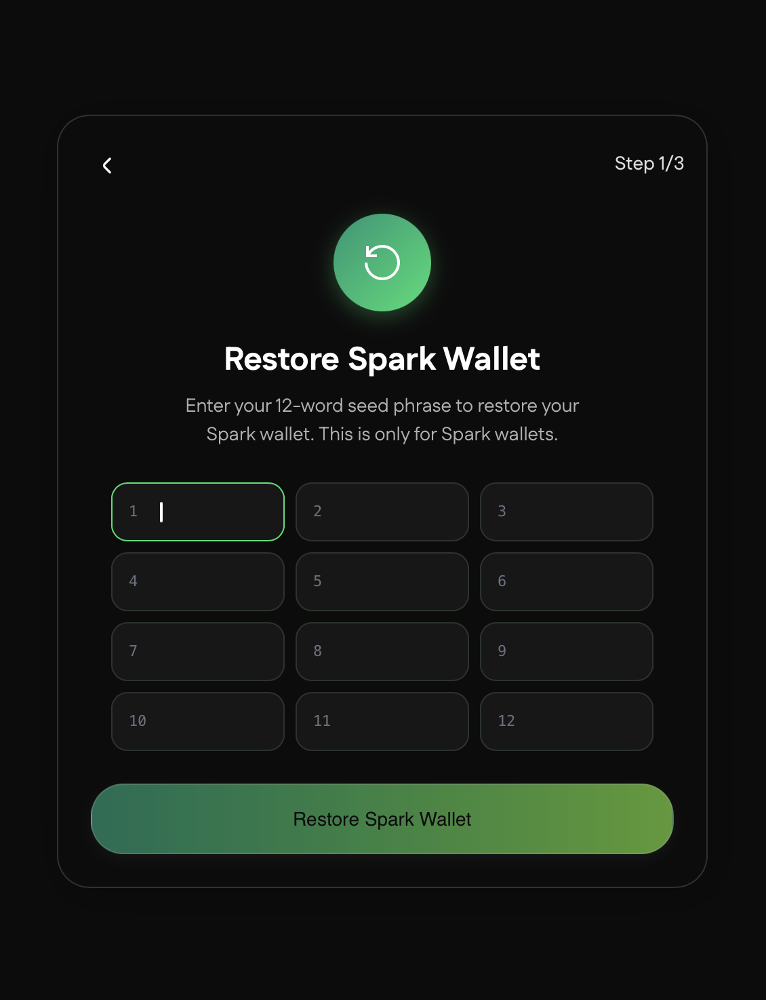

# BuhoGO User Guide

This guide walks you through everything you need to know to use BuhoGO for your Bitcoin Lightning payments.

Back to [README](README.md) | For developers: [Developer Guide](Developer.md)

 

## Table of Contents

1. [Choosing Your Wallet Type](#choosing-your-wallet-type)
2. [Setting Up a Spark Wallet](#setting-up-a-spark-wallet)
3. [Connecting an NWC Wallet](#connecting-an-nwc-wallet)
4. [Receiving Bitcoin](#receiving-bitcoin)
5. [Sending Bitcoin](#sending-bitcoin)
6. [Transaction History](#transaction-history)
7. [Managing Contacts](#managing-contacts)
8. [Switching Wallets](#switching-wallets)
9. [Settings and Preferences](#settings-and-preferences)
10. [Troubleshooting](#troubleshooting)

 

## Choosing Your Wallet Type

BuhoGO supports two types of wallets. Choose the one that fits your needs. See the [feature comparison table](README.md#payment-capabilities) for a quick overview.

### Spark Wallet

Best for users who want full control over their Bitcoin.

**Advantages**
- Self-custodial: You hold the keys
- Zero-fee transfers to other Spark users
- Works offline for viewing balance
- Single seed phrase backs up everything

**Considerations**
- Requires secure backup of seed phrase
- PIN required each session
- Limited to one Spark wallet per app

### NWC Wallet

Best for users who already have a Lightning wallet they want to use.

**Advantages**
- Connect your existing wallet (Alby, Mutiny, etc.)
- No seed phrase to manage
- Multiple wallets supported
- Quick setup with QR code

**Considerations**
- Depends on external wallet availability
- Features limited by connected wallet capabilities
- Cannot send to Spark addresses

 

## Setting Up a Spark Wallet

### Step 1: Start Wallet Creation

Open BuhoGO and tap "Create Wallet" on the welcome screen.

### Step 2: Save Your Seed Phrase

You will see 12 words displayed on screen. These words are your **only way** to recover your wallet.

**Important**:
- Write these words down on paper in the exact order shown
- Store them in a secure, offline location
- Never store them digitally, take screenshots, or share them with anyone
- Anyone with these words can access your Bitcoin

**We cannot recover your phrase if you lose it.** Your funds are entirely in your hands.

### Step 3: Verify Your Backup

The app will show all 12 words shuffled in random order. You must tap each word in the correct sequence (1-12) to prove you've properly recorded your backup.

**How it works:**
- Tap the first word of your seed phrase
- A green badge with "1" appears on that word
- Continue tapping words in order (2, 3, 4... up to 12)
- If you tap the wrong word, you'll see a red badge and an error message
- Use "Show me again" if you need to go back and check your written backup

Once all 12 words are selected correctly, you'll see a success message reminding you to store your phrase safely.

### Step 4: Create Your PIN

Enter a 6-digit PIN, then confirm it. This PIN protects your wallet and is required to:

- Unlock the wallet on app launch
- View your seed phrase in settings
- Sign transactions

Choose a PIN you can remember but others cannot guess.

### Step 5: Done

Your wallet is now ready. You will be taken to the main wallet screen where you can start receiving and sending Bitcoin.

 

 

## Connecting an NWC Wallet

### What is NWC?

Nostr Wallet Connect (NWC) is a protocol that lets apps communicate with Lightning wallets. Many popular wallets support NWC including Alby, Mutiny, and others.

### Getting Your NWC Connection String

1. Open your existing Lightning wallet
2. Look for "Nostr Wallet Connect" or "NWC" in settings
3. Create a new connection for BuhoGO
4. Copy the connection string (starts with `nostr+walletconnect://`)

### Connecting in BuhoGO

1. Open BuhoGO and tap "Connect Wallet"
2. Either paste your NWC string or tap the QR icon to scan
3. Give your wallet a name for easy identification
4. Tap "Connect"

Your wallet balance and info will appear once connected.

### Adding More NWC Wallets

You can connect multiple NWC wallets:

1. Go to Settings
2. Tap "Add Wallet"
3. Follow the same connection steps

 

## Receiving Bitcoin

### Using Lightning Invoice (All Wallets)

Lightning invoices are the standard way to receive Bitcoin on the Lightning Network.

1. Tap the "Receive" button on the wallet screen
2. Enter the amount you want to receive (in sats)
3. Optionally add a description
4. Tap "Create Invoice"
5. Share the QR code or copy the invoice string

The invoice expires after a set time (usually 1 hour). If not paid before expiry, create a new one.

### Using Spark Address (Spark Wallet Only)

Spark addresses allow you to receive instant, zero-fee payments from other Spark users.

1. Tap the "Receive" button
2. Toggle to "Spark Address" view
3. Share the QR code or copy the address

Your Spark address never changes and does not expire. Anyone with a Spark wallet can send to it without fees.

**Tip**: Your Spark address starts with `sp1` (mainnet) or `tsp1` (testnet).

 

## Sending Bitcoin

### Using the QR Scanner

The fastest way to pay:

1. Tap the "Send" button
2. Point your camera at the payment QR code
3. Confirm the amount and details
4. Tap "Send"

### Manual Entry

1. Tap the "Send" button
2. Tap the paste icon or type the payment destination
3. The app detects the payment type automatically:
   - Lightning invoice (`lnbc...`)
   - Lightning address (`name@domain.com`)
   - Spark address (`sp1...`) - Spark wallet only
   - LNURL (`lnurl...`)

### Using Contacts

1. Tap the "Send" button
2. Scroll down to see your saved contacts
3. Tap a contact to start a payment

**Note**: Contacts with Spark addresses show a badge and require a Spark wallet to pay.

### Payment Confirmation

Before sending, you will see:
- Recipient address or invoice
- Amount in sats and your local currency
- Network fee (if applicable)

Review these details carefully before confirming.

 

## Transaction History

Your transaction history shows all payments sent and received. Access it by tapping "Transactions" on the main wallet screen.

### Grouped Transactions

When you send or receive multiple payments to/from the same destination within a short period, BuhoGO automatically groups them together to keep your transaction list clean and organized.

 

Tap on a grouped transaction to expand and see individual payments within the group.

 

## Managing Contacts

### Adding a Contact

1. Go to Settings > Address Book
2. Tap the "+" button
3. Enter the contact name
4. Choose address type (Lightning or Spark)
5. Enter the address
6. Tap "Save"

### Editing a Contact

1. Go to Settings > Address Book
2. Tap on the contact
3. Make your changes
4. Tap "Save"

### Deleting a Contact

1. Go to Settings > Address Book
2. Tap on the contact
3. Tap "Delete"
4. Confirm deletion

### Contact Types

**Lightning Address**: Format like `name@domain.com`. Works with all wallet types.

**Spark Address**: Format starting with `sp1...`. Only payable from Spark wallets. These payments are instant and free.

 

## Switching Wallets

If you have multiple wallets:

1. Tap the wallet name at the top of the main screen
2. Select the wallet you want to use
3. The app switches to that wallet immediately

The active wallet indicator shows which wallet is currently selected.

### Setting a Default Wallet

Your most recently used wallet becomes the default. When you open the app, it will load this wallet automatically.

 

## Settings and Preferences

### Theme

Toggle between dark and light modes in Settings > Appearance.

### Language

Change the app language in Settings > Language.

### Currency

Set your preferred fiat currency for price display in Settings.

### Spark Wallet Settings

For Spark wallets, additional options are available:

**View Seed Phrase**: Requires PIN entry. Use this to verify your backup.

**Change PIN**: Update your wallet PIN.

**Delete Wallet**: Permanently removes the Spark wallet. Make sure you have your seed phrase backed up before deleting.

### NWC Wallet Settings

**Rename**: Change the display name for the wallet.

**Disconnect**: Removes the NWC connection. You can reconnect later with the same or different connection string.

 

## Troubleshooting

For technical issues and developer debugging, see [Common Issues](Developer.md#common-issues) in the Developer Guide.

### Spark Wallet Issues

**Forgot PIN**
There is no PIN recovery. If you have your seed phrase, delete and restore the wallet:
1. Uninstall and reinstall the app
2. Select "Restore Wallet"
3. Enter your 12-word seed phrase
4. Set a new PIN

**Payment Failed**
- Check your balance is sufficient
- Verify the recipient address is correct
- For Lightning payments, the recipient must have inbound capacity
- Try a smaller amount

### NWC Wallet Issues

**Connection Failed**
- Verify your NWC string is complete and correct
- Check that your wallet provider is online
- Try generating a new NWC connection string

**Balance Not Showing**
- Pull down to refresh
- Check your wallet provider app is running
- Verify the NWC connection has balance read permissions

**Cannot Send Payment**
- Some NWC connections have spending limits
- Check your wallet provider for any restrictions
- Verify the payment destination is valid

### General Issues

**App Crashes on Launch**
- Force close and reopen the app
- Clear app cache in your device settings
- Reinstall if problems persist (backup first!)

**QR Scanner Not Working**
- Ensure camera permissions are granted
- Check for adequate lighting
- Try moving closer to or further from the QR code

 

## Payment Format Reference

| Format | Example | Description |
|--------|---------|-------------|
| Lightning Invoice | `lnbc10u1p...` | One-time payment request with encoded amount |
| Lightning Address | `satoshi@wallet.com` | Reusable address, similar to email |
| Spark Address | `sp1qw3e...` | Spark network address for zero-fee transfers |
| LNURL | `lnurl1dp68...` | Encoded URL for various Lightning operations |

 

## Tips for New Users

1. **Start Small**: Make your first few transactions with small amounts until you are comfortable.

2. **Verify Addresses**: Always double-check recipient addresses before sending. Bitcoin transactions cannot be reversed.

3. **Backup Immediately**: For Spark wallets, back up your seed phrase before receiving any funds.

4. **Test Receive First**: Generate a small test invoice to verify your setup works correctly.

5. **Keep PIN Private**: Never share your PIN with anyone. BuhoGO support will never ask for it.

 

## Getting Help

If you encounter issues not covered in this guide:

- Check the [GitHub Issues](https://github.com/Buho-Ecosystem/Buho_go/issues) for known problems
- Open a new issue with details about your problem
- Include your wallet type (Spark or NWC) and steps to reproduce

 

## Related Documentation

- [README](README.md) - Project overview and quick start
- [Use Cases](USE_CASES.md) - Real-world scenarios and examples
- [Developer Guide](Developer.md) - Technical documentation for contributors

 

*This guide is updated regularly. Check back for new features and improvements.*
