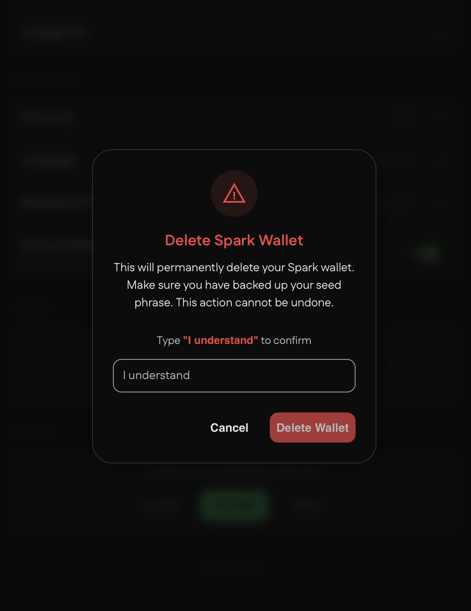
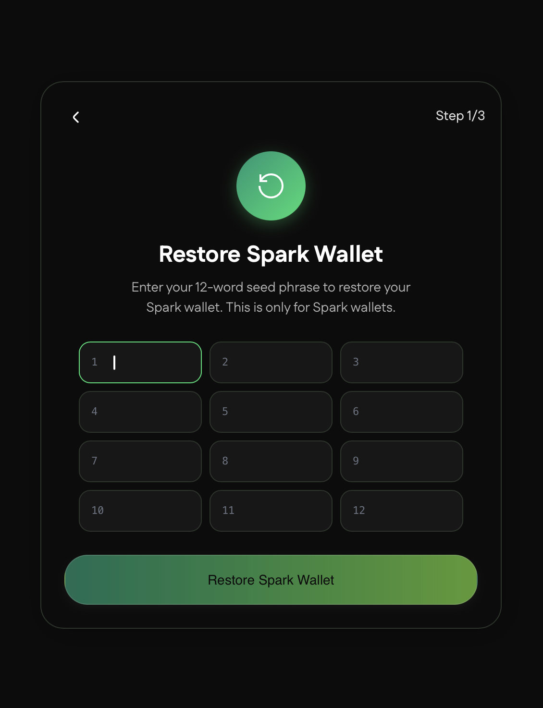

# BuhoGO User Guide

This guide walks you through everything you need to know to use BuhoGO.

Back to [README](README.md) | For developers: [Developer Guide](Developer.md)

 

## Table of Contents

1. [Choosing Your Wallet Type](#choosing-your-wallet-type)
2. [Setting Up a Spark Wallet](#setting-up-a-spark-wallet)
3. [Connecting an NWC Wallet](#connecting-an-nwc-wallet)
4. [Connecting an LNBits Wallet](#connecting-an-lnbits-wallet)
5. [Receiving Bitcoin](#receiving-bitcoin)
6. [Sending Bitcoin](#sending-bitcoin)
7. [Batch Send](#batch-send)
8. [Internal Transfer](#internal-transfer)
9. [Auto-Transfer](#auto-transfer)
10. [Transaction History](#transaction-history)
11. [Managing Contacts](#managing-contacts)
12. [Switching Wallets](#switching-wallets)
13. [Kiosk Mode](#kiosk-mode)
14. [Settings and Preferences](#settings-and-preferences)
15. [Troubleshooting](#troubleshooting)

 

## Choosing Your Wallet Type

BuhoGO supports three wallet types. See the [feature comparison](README.md#payment-capabilities) for details.

### Spark Wallet

Full self-custody with your own keys.

- Zero-fee transfers to other Spark users
- On-chain Bitcoin (L1) deposits and withdrawals
- Business and Personal accounts from one seed
- Single seed phrase backs up everything

### NWC Wallet

Connect your existing Lightning wallet (Alby, Primal, etc.).

- No seed phrase to manage
- Multiple wallets supported
- Quick setup with QR code
- Cannot send to Spark addresses or on-chain

### LNBits Wallet

Connect to your own LNBits instance.

- Works with any LNBits server
- Full control via Admin API key
- Multiple wallets supported
- Cannot send to Spark addresses or on-chain

 

## Setting Up a Spark Wallet

### Step 1: Start Wallet Creation

Open BuhoGO and tap "Create Wallet" on the welcome screen.

### Step 2: Save Your Seed Phrase

You will see 12 words displayed on screen. These words are your **only way** to recover your wallet.

**Important**:
- Write these words down on paper in the exact order shown
- Store them in a secure, offline location
- Never store them digitally, take screenshots, or share them with anyone
- Anyone with these words can access your Bitcoin

**We cannot recover your phrase if you lose it.** Your funds are entirely in your hands.

### Step 3: Verify Your Backup

The app shows all 12 words shuffled in random order. Tap each word in the correct sequence (1 through 12) to prove you recorded your backup properly.

**How it works:**
- Tap the first word of your seed phrase
- A green badge with "1" appears on that word
- Continue tapping words in order (2, 3, 4... up to 12)
- If you tap the wrong word, you'll see a red badge and an error message
- Use "Show me again" if you need to go back and check your written backup

Once all 12 words are selected correctly, you'll see a success message.

### Step 4: Done

Your wallet is ready with two accounts: **Business** and **Personal**. You can switch between them using the wallet switcher at the top of the main screen.

 

Your seed phrase is encrypted on-device using a unique device key. No PIN entry is required on each launch unless you enable biometric app lock.

 

## Connecting an NWC Wallet

### What is NWC?

Nostr Wallet Connect (NWC) is a protocol that lets apps communicate with Lightning wallets. Many popular wallets support NWC including Alby, Primal, and others.

### Getting Your NWC Connection String

1. Open your existing Lightning wallet
2. Look for "Nostr Wallet Connect" or "NWC" in settings
3. Create a new connection for BuhoGO
4. Copy the connection string (starts with `nostr+walletconnect://`)

### Connecting in BuhoGO

1. Open BuhoGO and tap "Connect Wallet"
2. Either paste your NWC string or tap the QR icon to scan
3. Give your wallet a name for easy identification
4. Tap "Connect"

Your wallet balance and info will appear once connected.

To add more NWC wallets, go to Settings > Add Wallet.

 

## Connecting an LNBits Wallet

### Getting Your LNBits Credentials

1. Log in to your LNBits instance
2. Open your wallet and click "API Info"
3. Copy your **Server URL**, **Wallet ID** and **Admin API Key**

**Important**: The Admin Key gives full wallet access. Keep it private.

### Connecting in BuhoGO

1. Tap "Connect Wallet" > "LNBits"
2. Enter a name for your wallet
3. Enter your LNBits server URL
4. Enter your Admin API key
5. Tap "Connect"

To add more LNBits wallets, go to Settings > Add Wallet.

 

## Receiving Bitcoin

### Using Lightning Invoice (All Wallets)

Lightning invoices are the standard way to receive Bitcoin on the Lightning Network.

1. Tap the "Receive" button on the wallet screen
2. Enter the amount you want to receive (in sats)
3. Optionally add a description
4. Tap "Create Invoice"
5. Share the QR code or copy the invoice string

The invoice expires after a set time (usually 1 hour). If not paid before expiry, create a new one.

### Using Spark Address (Spark Wallet Only)

Spark addresses allow you to receive instant, zero-fee payments from other Spark users.

1. Tap the "Receive" button
2. Toggle to "Spark Address" view
3. Share the QR code or copy the address

Your Spark address never changes and does not expire. Anyone with a Spark wallet can send to it without fees.

**Note**: Spark addresses start with `spark1` on mainnet.

### Receiving On-Chain Bitcoin (Spark Wallet Only)

For receiving from exchanges or on-chain wallets:

1. Tap "Receive" and switch to the "Bitcoin" tab
2. Copy your Bitcoin address (starts with `bc1p...`)
3. Send Bitcoin to this address from any on-chain wallet or exchange
4. Wait for 3 confirmations (roughly 30 minutes)
5. Tap "Claim" to add the funds to your Lightning balance

 

## Sending Bitcoin

### Using the QR Scanner

The fastest way to pay:

1. Tap the "Send" button
2. Point your camera at the payment QR code
3. Confirm the amount and details
4. Tap "Send"

### Manual Entry

1. Tap the "Send" button
2. Tap the paste icon or type the payment destination
3. The app detects the payment type automatically:
   - Lightning invoice (`lnbc...`)
   - Lightning address (`name@domain.com`)
   - Spark address (`spark1...`) - Spark wallet only
   - LNURL (`lnurl...`)
   - Bitcoin address (`bc1p...`, `bc1q...`) - Spark wallet only

### Using Contacts

1. Tap the "Send" button
2. Scroll down to see your saved contacts
3. Tap a contact to start a payment

### Sending On-Chain Bitcoin (Spark Wallet Only)

1. Tap "Send" and enter or scan a Bitcoin address
2. Enter the amount
3. Choose fee speed: Economy, Standard, or Priority
4. Review the fee breakdown and confirm

### Payment Confirmation

Before sending, you will see:
- Recipient address or invoice
- Amount in sats and your local currency
- Network fee (if applicable)

Review these details carefully before confirming.

 

## Batch Send

Send payments to multiple contacts at once. Useful for splitting bills, paying contributors, or distributing funds.

### How to Use

1. Open Address Book or Quick Contacts
2. Tap the batch send icon (layer icon)
3. Select contacts you want to pay
4. Choose amount mode:
   - **Same amount**: Everyone gets the same
   - **Custom amounts**: Set different amounts per contact
5. Review total and confirm
6. Watch payments sent one by one

### What to Know

- Payments are sent sequentially
- Real-time progress for each payment
- If one fails, the rest continue
- Retry failed payments after batch completes
- 1% of balance reserved for fees

### Address Type Support

| Contact Type | Spark Wallet | NWC/LNBits |
|--------------|--------------|------------|
| Lightning Address | Yes | Yes |
| Spark Address | Yes | No |
| Bitcoin Address | Yes | No |

Spark and Bitcoin contacts only appear when using a Spark wallet.

 

## Internal Transfer

Move funds between your connected wallets without leaving the app.

### How to Transfer

1. Go to Settings
2. Tap "Transfer Between Wallets"
3. Select source wallet (where funds come from)
4. Select destination wallet (where funds go)
5. Enter amount
6. Confirm transfer

### How It Works

The app creates a Lightning invoice from the destination wallet and pays it from the source wallet.

- Standard Lightning fees apply (typically minimal)
- Both wallets must support Lightning
- Spark-to-Spark transfers are instant and free

 

## Auto-Transfer

Set up automatic payouts when your wallet balance exceeds a threshold.

### How to Configure

1. Go to Settings > Auto-Transfer
2. Select a wallet
3. Set a balance threshold (when balance exceeds this, a transfer triggers)
4. Choose a destination type:
   - **Lightning Address** (e.g. `you@wallet.com`)
   - **Bitcoin Address** (on-chain, Spark wallets only)
   - **Spark Address** (zero-fee, Spark wallets only)
5. For on-chain destinations, choose a fee speed
6. Enable the rule

### What to Know

- 60-second cooldown between triggers per wallet
- Minimum send amount is 10 sats
- Auto-transfers are tagged in transaction history
- Rules persist across app sessions

 

## Transaction History

Your transaction history shows all payments sent and received. Access it by tapping "Transactions" on the main wallet screen.

### Grouped Transactions

When you send or receive multiple payments to/from the same destination within a short period, BuhoGO groups them together to keep the list clean.

 

Tap on a grouped transaction to expand and see individual payments.

### Transaction Details

Tap any transaction to see the full details page:
- Amount, fees, and fiat equivalent
- Date and time
- Payment hash and preimage
- Add notes or tags for your records
- Link to a contact from your address book

 

## Managing Contacts

### Adding a Contact

1. Go to Address Book
2. Tap the "+" button
3. Enter the contact name
4. Choose address type (Lightning, Spark, or Bitcoin)
5. Enter the address
6. Tap "Save"

### Contact Features

- **Color coding**: Each contact gets a color for quick identification
- **Favorites**: Mark contacts you pay frequently
- **Recent contacts**: Last 5 contacts used in the past 30 days appear first
- **Notes**: Add notes to any contact
- **Search**: Filter contacts by name, address, or notes

### Contact Types

**Lightning Address**: Format like `name@domain.com`. Works with all wallet types.

**Spark Address**: Format starting with `spark1...`. Only payable from Spark wallets. These payments are instant and free.

**Bitcoin Address**: On-chain address starting with `bc1...`. Only payable from Spark wallets.

 

## Switching Wallets

If you have multiple wallets:

1. Tap the wallet name at the top of the main screen
2. Select the wallet you want to use
3. The app switches to that wallet immediately

For Spark wallets, you can also switch between Business and Personal accounts using the wallet switcher.

Your most recently used wallet becomes the default on app launch.

 

## Kiosk Mode

Turn your device into a dedicated payment terminal for a shop, cafe, or any point-of-sale scenario.

### Setting Up

1. Go to Settings > Kiosk Mode
2. Enable the toggle
3. Select the destination wallet (where payments go)
4. Set a 4-digit PIN (this unlocks the owner area)
5. Configure tips and rounding preferences
6. Tap "Start Kiosk Mode"

### Kiosk Configuration

- **Destination Wallet**: Which wallet receives payments
- **Enable Tips**: Show tip buttons (5%, 10%, 20% by default, customizable)
- **Round Up**: Round amounts to the next whole number
- **Display Currency**: Show amounts in sats or fiat

### Using Kiosk Mode

Once started, the device shows a POS keypad. Employees can:

1. Enter the payment amount
2. Customer optionally selects a tip
3. QR code is generated for the customer to scan
4. Payment confirmation appears on success

### Owner Access

Enter the 4-digit PIN to access settings or disable kiosk mode. Deep links are blocked while kiosk is locked to prevent employees from navigating away.

 

## Settings and Preferences

### Theme

Toggle between dark and light modes in Settings > Appearance.

### Language

Change the app language in Settings > Language. Available: English, German, Spanish.

### Currency

Set your preferred fiat currency for price display in Settings.

### Display Format

Toggle BIP-177 format to show amounts as bitcoin denominations (e.g. 1,234 sats).

### App Lock

Enable biometric authentication (fingerprint or face) to lock the app on mobile devices.

### Spark Wallet Settings

**View Seed Phrase**: Displays your backup phrase. Use this to verify your written copy.

**Delete Wallet**: Permanently removes the Spark wallet. Make sure you have your seed phrase backed up before deleting.

### NWC/LNBits Wallet Settings

**Rename**: Change the display name for the wallet.

**Disconnect**: Removes the wallet connection. You can reconnect later.

 

## Troubleshooting

For technical issues and developer debugging, see [Common Issues](Developer.md#common-issues) in the Developer Guide.

### Spark Wallet Issues

**Forgot PIN / Lost Access**
If you have your seed phrase, delete and restore the wallet:
1. Uninstall and reinstall the app
2. Select "Restore Wallet"
3. Enter your 12-word seed phrase

**Payment Failed**
- Check your balance is sufficient
- Verify the recipient address is correct
- For Lightning payments, the recipient must have inbound capacity
- Try a smaller amount

### NWC Wallet Issues

**Connection Failed**
- Verify your NWC string is complete and correct
- Check that your wallet provider is online
- Try generating a new NWC connection string

**Balance Not Showing**
- Pull down to refresh
- Check your wallet provider app is running
- Verify the NWC connection has balance read permissions

**Cannot Send Payment**
- Some NWC connections have spending limits
- Check your wallet provider for any restrictions
- Verify the payment destination is valid

### LNBits Wallet Issues

**Connection Failed**
- Verify server URL is correct and uses HTTPS
- Check Admin API key is valid (not Invoice key)
- Try accessing LNBits server in browser first

**Payment Failed**
- Check wallet has sufficient balance
- Verify invoice is valid and not expired
- Check LNBits server logs for details

### General Issues

**App Crashes on Launch**
- Force close and reopen the app
- Clear app cache in your device settings
- Reinstall if problems persist (backup your seed phrase first!)

**QR Scanner Not Working**
- Ensure camera permissions are granted
- Check for adequate lighting
- Try moving closer to or further from the QR code

 

## Payment Format Reference

| Format | Example | Description |
|--------|---------|-------------|
| Lightning Invoice | `lnbc10u1p...` | One-time payment request with encoded amount |
| Lightning Address | `satoshi@wallet.com` | Reusable address, similar to email |
| Spark Address | `spark1qw3e...` | Spark network address for zero-fee transfers |
| LNURL | `lnurl1dp68...` | Encoded URL for various Lightning operations |
| Bitcoin Address (L1) | `bc1p...`, `bc1q...` | On-chain Bitcoin address (Spark only) |

 

## Tips for New Users

1. **Start Small**: Make your first few transactions with small amounts until you are comfortable.

2. **Verify Addresses**: Always double-check recipient addresses before sending. Bitcoin transactions cannot be reversed.

3. **Backup Immediately**: For Spark wallets, back up your seed phrase before receiving any funds.

4. **Test Receive First**: Generate a small test invoice to verify your setup works correctly.

 

## Getting Help

If you encounter issues not covered in this guide:

- Check the [GitHub Issues](https://github.com/Buho-Ecosystem/Buho_go/issues) for known problems
- Open a new issue with details about your problem
- Include your wallet type (Spark, NWC, or LNBits) and steps to reproduce

 

## Related Documentation

- [README](README.md) - Project overview and quick start
- [Use Cases](use_cases.md) - Real-world scenarios and examples
- [Developer Guide](Developer.md) - Technical documentation for contributors
