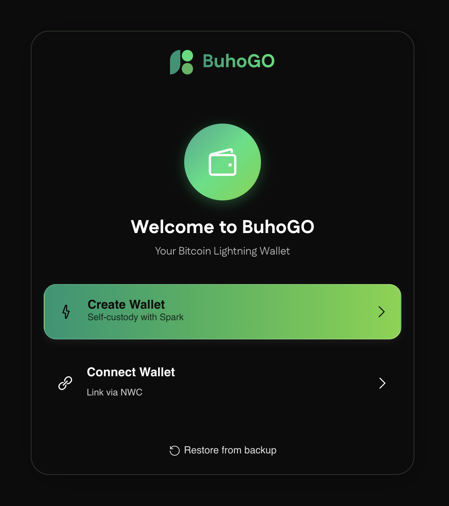
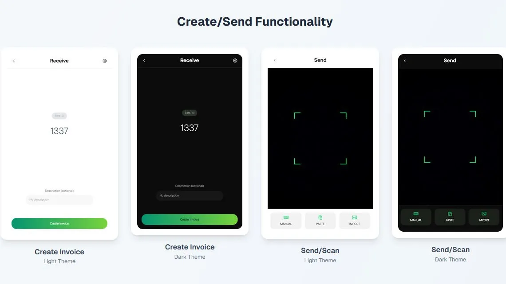
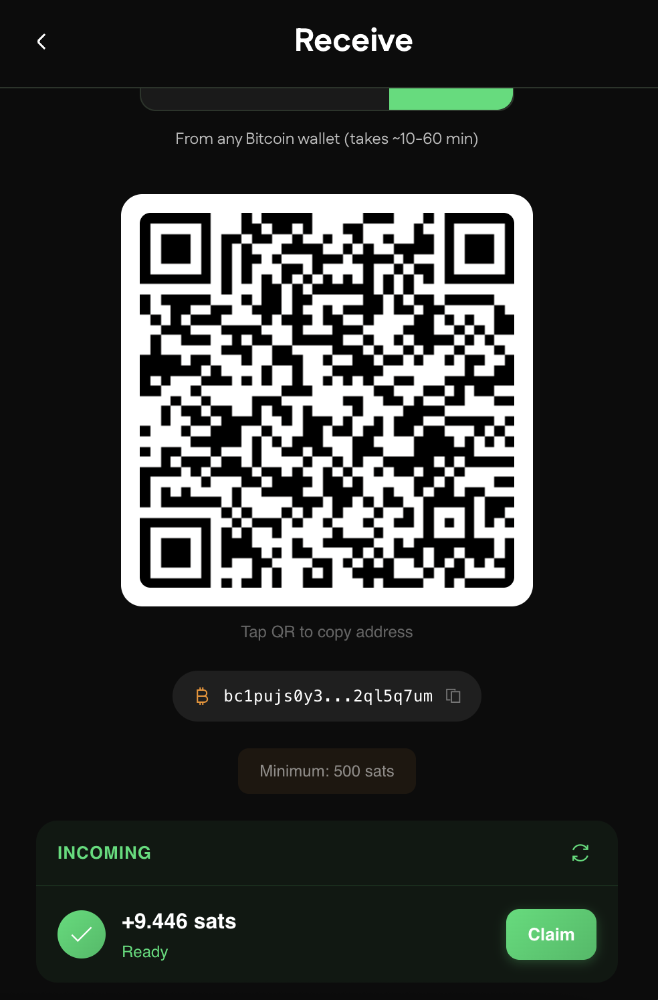
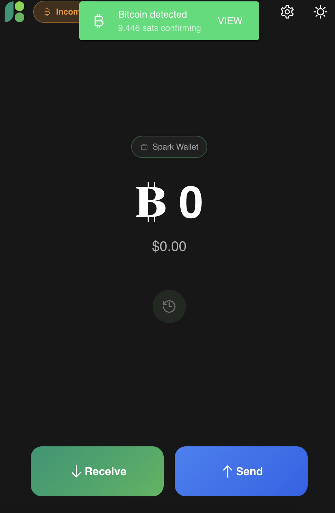
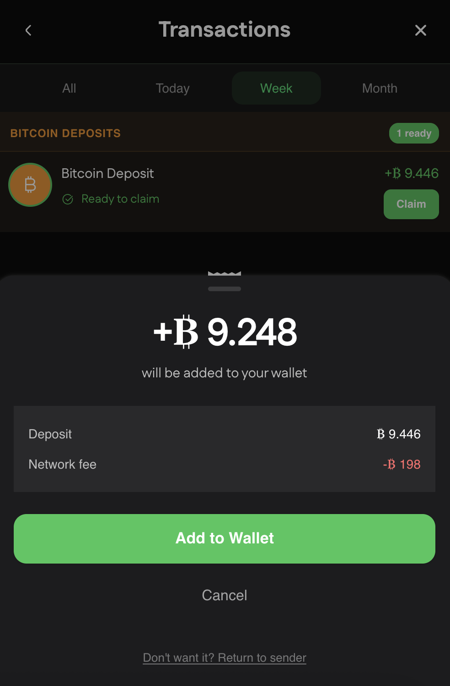
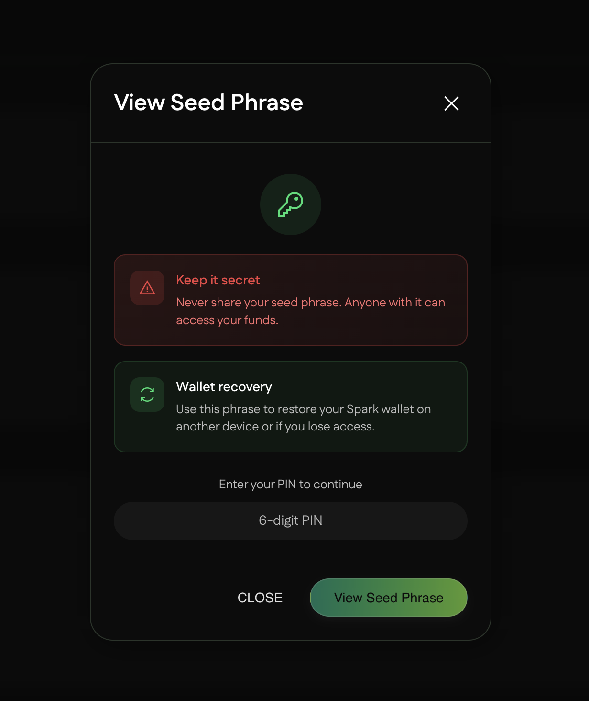
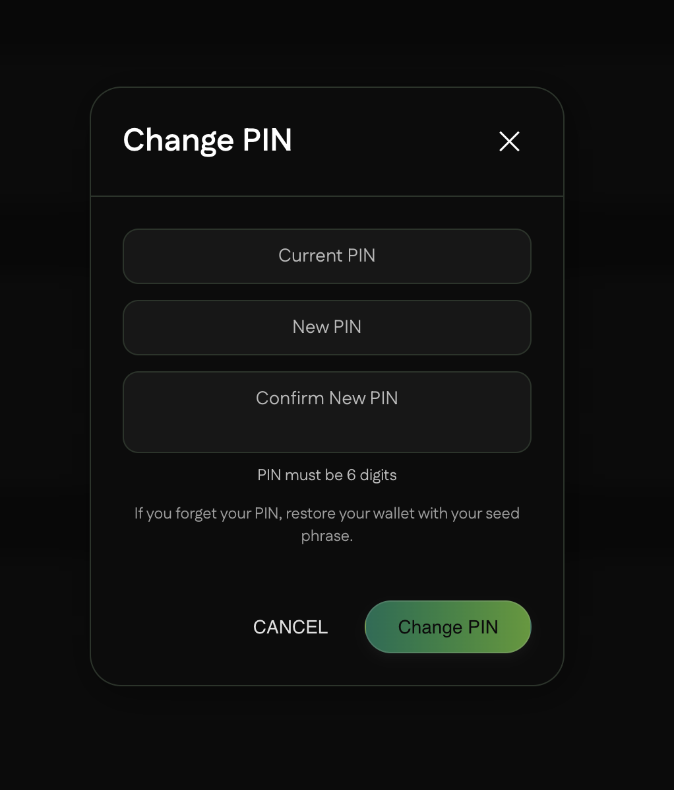

# BuhoGO

**Bitcoin Lightning Wallet for Web and Mobile**

BuhoGO is an open-source wallet application that makes Bitcoin Lightning payments accessible to everyone. Whether you prefer full self-custody with Spark, want to connect your existing wallet via NWC, or use your own LNBits instance, BuhoGO provides a clean, intuitive interface for everyday Bitcoin transactions.

[Live App](https://go.mybuho.de) | [Report Issues](https://github.com/Buho-Ecosystem/Buho_go/issues)


<br>

## Features

### Three Wallet Options

**Spark Wallet (Self-Custodial)**
- Generate a new wallet with 12-word seed phrase
- Full control over your Bitcoin with PIN-protected encryption
- Zero-fee instant transfers to other Spark users
- Standard Lightning Network payments with minimal fees
- On-chain Bitcoin (L1) deposits and withdrawals

**NWC Connected Wallet**
- Connect any Nostr Wallet Connect compatible wallet
- Use your existing Lightning setup (Alby, Primal, Buho etc.)
- Multiple NWC wallets supported simultaneously
- No seed phrase management required

**LNBits Wallet**
- Connect directly to your LNBits instance
- Full wallet control via Admin API key
- Self-hosted or use public LNBits servers
- Multiple LNBits wallets supported simultaneously

### Payment Capabilities

| Feature | Spark | NWC | LNBits |
|---------|-------|-----|--------|
| Pay Lightning Invoices | Yes | Yes | Yes |
| Pay Lightning Addresses | Yes | Yes | Yes |
| Pay LNURL Requests | Yes | Yes | Yes |
| Receive Lightning | Yes | Yes | Yes |
| Spark-to-Spark Transfers | Yes | No | No |
| Zero-Fee Transfers | Yes | No | No |
| Receive On-Chain Bitcoin (L1) | Yes | No | No |
| Send to On-Chain Address (L1) | Yes | No | No |
| Fee Estimation | Yes | No | No |

### Additional Features

- **QR Scanner**: Scan invoices, addresses, and LNURL codes
- **Address Book**: Save contacts with Lightning or Spark addresses
- **Transaction History**: Complete record of all payments
- **Multi-Wallet**: Switch between wallets instantly
- **Dark and Light Themes**: Choose your preferred appearance
- **Multi-Language**: Available in multiple languages
- **Real-Time Prices**: Bitcoin price display in your currency

<br>

## Screenshots

### Interface Themes

 

### Welcome Screen



### Send and Receive



### Spark Wallet Setup

  

### Transaction History

 

### On-Chain Bitcoin (L1)

  

### Settings

 

<br>

## Quick Start

### Installation

```bash
# Clone the repository
git clone https://github.com/Buho-Ecosystem/Buho_go.git
cd Buho_go

# Install dependencies
npm install

# Start development server
npm run dev
```

The app will be available at `http://localhost:9000`

### Production Build

```bash
npm run build
```

Build output will be in the `dist/spa` directory.

<br>

## Getting Started

For detailed step-by-step instructions, see the [User Guide](Guide.md).

### Option A: Create a Spark Wallet

1. Open the app and select "Create Wallet"
2. Write down your 12-word seed phrase (this is your backup)
3. Verify your backup by entering 3 random words
4. Set a 6-digit PIN to protect your wallet
5. Start sending and receiving Bitcoin

See [Setting Up a Spark Wallet](Guide.md#setting-up-a-spark-wallet) for detailed instructions.

### Option B: Connect an NWC Wallet

1. Open the app and select "Connect Wallet"
2. Get your NWC connection string from your wallet provider
3. Paste the string or scan the QR code
4. Your wallet is now connected

See [Connecting an NWC Wallet](Guide.md#connecting-an-nwc-wallet) for detailed instructions.

### Option C: Connect an LNBits Wallet

1. Open the app and select "Connect Wallet" then "LNBits"
2. Enter your LNBits server URL
3. Enter your LNBits wallet ID
4. Enter your Admin API key (from LNBits wallet settings)
5. Your wallet is now connected

See [Connecting an LNBits Wallet](Guide.md#connecting-an-lnbits-wallet) for detailed instructions.

### Making Payments

BuhoGO accepts multiple payment formats:

- **Lightning Invoice**: Strings starting with `lnbc...`
- **Lightning Address**: Email-like format `name@domain.com`
- **LNURL**: Encoded payment requests starting with `lnurl...`
- **Spark Address**: Strings starting with `sp1...` (Spark wallets only)
- **Bitcoin Address (L1)**: On-chain addresses starting with `bc1...` (Spark wallets only)

Simply scan a QR code or paste the payment destination and the app handles the rest.

<br>

## Security

For technical details on the encryption implementation, see the [Developer Guide](Developer.md#security-considerations).

### Spark Wallet Security

- Seed phrases are encrypted with AES-256-GCM
- PIN is required to unlock and view seed phrase
- Private keys never leave your device
- No server-side storage of sensitive data

### NWC Wallet Security

- Connection strings stored locally only
- Each wallet operates independently
- Non-custodial architecture throughout

### Best Practices

- Back up your Spark seed phrase securely offline
- Use a unique PIN you can remember
- Verify recipient addresses before sending
- Start with small amounts when testing

<br>

## Tech Stack

For detailed architecture documentation, see the [Developer Guide](Developer.md#architecture-overview).

| Component | Technology |
|-----------|------------|
| Framework | Vue.js 3 |
| UI Library | Quasar Framework |
| State Management | Pinia |
| Build Tool | Vite |
| Lightning (Spark) | @buildonspark/spark-sdk |
| Lightning (NWC) | @getalby/sdk |
| Lightning (LNBits) | LNBits REST API |
| Mobile | Capacitor (iOS/Android) |

<br>

## Project Structure

```
src/
  components/       # Reusable Vue components
  pages/            # Application pages/routes
  providers/        # Wallet provider implementations
  stores/           # Pinia state stores
  css/              # Global styles
  i18n/             # Internationalization files
  router/           # Vue Router configuration
```

<br>

## Documentation

- [User Guide](Guide.md) - Step-by-step instructions for using BuhoGO
- [Use Cases](USE_CASES.md) - Real-world scenarios and examples
- [Developer Guide](Developer.md) - Technical documentation for contributors

<br>

## Contributing

Contributions are welcome. Please read the [Developer Guide](Developer.md) before contributing.

1. Fork the repository
2. Create a feature branch
3. Make your changes following the [Styling Guidelines](Developer.md#styling-guidelines)
4. Submit a pull request

<br>

## License

MIT License - Use it, modify it, contribute back.

<br>

## Links

- **Web App**: [go.mybuho.de](https://go.mybuho.de)
- **GitHub**: [Buho-Ecosystem/Buho_go](https://github.com/Buho-Ecosystem/Buho_go)
- **Google PlayStore**: [BuhoGO](https://play.google.com/store/apps/details?id=mybuho.buhogo)

<br>

*Built for the Bitcoin community by people who use Bitcoin every day.*
