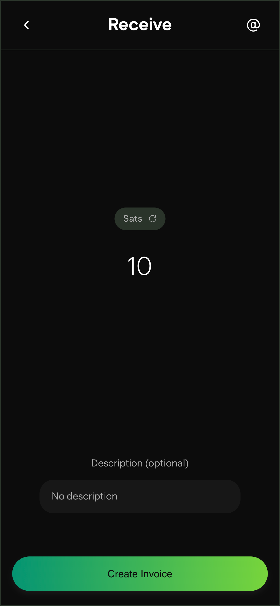
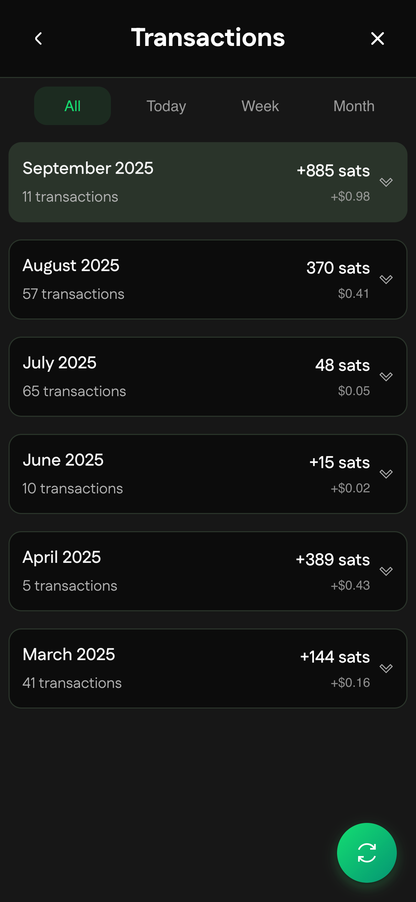
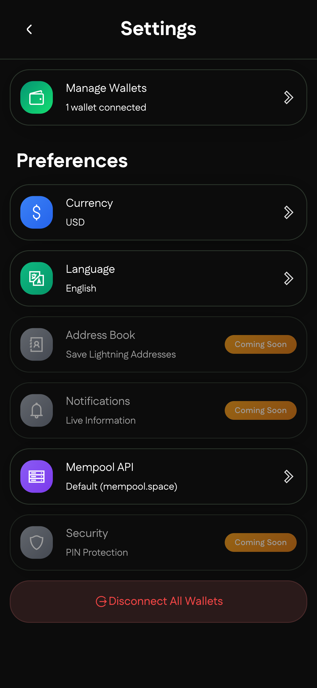

# 🦉 Buhogo - Bitcoin Payments Made Simple

**Send and receive Bitcoin instantly. Connect any wallet, pay anywhere.**

Buhogo is an open-source mobile wallet that brings Bitcoin and Lightning Network payments to everyone. Whether you're
new to Bitcoin or a seasoned user managing multiple wallets, we've built something that just works.

## Why Buhogo?

We believe Bitcoin payments should be as easy as sending a text message. That's why we created Buhogo – a wallet that
connects to your existing setup rather than locking you into ours. Think of it as your universal remote for Bitcoin
payments.

## What You Can Do

**Lightning-Fast Payments**

- Send Bitcoin in seconds with Lightning Network support
- Handle traditional on-chain transactions when you need them
- Pay lightning invoices, lightning addresses (like user@domain.com), and LNURL requests

**Connect Everything**

- Use multiple wallets simultaneously – switch between them with a tap
- Works with any NWC-compatible wallet
- Scan QR codes, paste from clipboard, or type manually

**Stay Informed**

- Track all your transactions with detailed history
- Get monthly spending summaries
- Watch real-time Bitcoin prices right in the app

**Made for Humans**

- Clean interface that actually makes sense
- Dark and light themes (because preferences matter)
- Available in multiple languages

## Getting Started

**Connect Your First Wallet**

1. Open the app and head to the Send screen
2. Add your wallet using Nostr Wallet Connect (NWC)
3. Start making payments immediately

**Making Your First Payment**
You can pay using any of these formats:

- Lightning invoices (those long strings starting with `lnbc`)
- Lightning addresses (simple as `friend@wallet.com`)
- LNURL payment requests
- Just scan a QR code and we'll figure out the rest

**Customize Your Experience**

- Toggle between dark and light themes in settings
- Change your language preference
- Set up multiple wallets for different use cases
- Take your own mempool for trustless fiat rates

## Screenshots & Interface

Our interface focuses on clarity and speed:

1. **Wallet Main Screen**: See all your connected wallets at a glance
   
2. **Transaction History**: Clean monthly breakdowns showing exactly where your sats went
   
3. **Settings**: Easily switch between light and dark modes, and set your preferred language.
   

## Security & Philosophy

**Open by Design**

- Full source code available for audit
- Non-custodial architecture – your keys, your coins
- NWC compatibility ensures secure wallet connections

**Multi-Wallet Isolation**
Each connected wallet operates independently, so your personal Lightning wallet stays separate from your business
payments.

## Community & Support

- **Web App**: [go.mybuho.de](https://go.mybuho.de)
- **Issues**: Report bugs or request features on GitHub

## License

MIT License – use it, modify it, contribute back if you can.

---

**What Makes Buhogo Different?**

Most Bitcoin wallets force you to choose: either use their solution entirely, or find something else. Buhogo works with
what you already have. We're the bridge between your existing Bitcoin setup and the payments you want to make.

Built with genuine care for the Bitcoin community – because better tools mean better adoption, and better adoption means
a better world.

*Made with ❤️ by people who actually use Bitcoin every day*