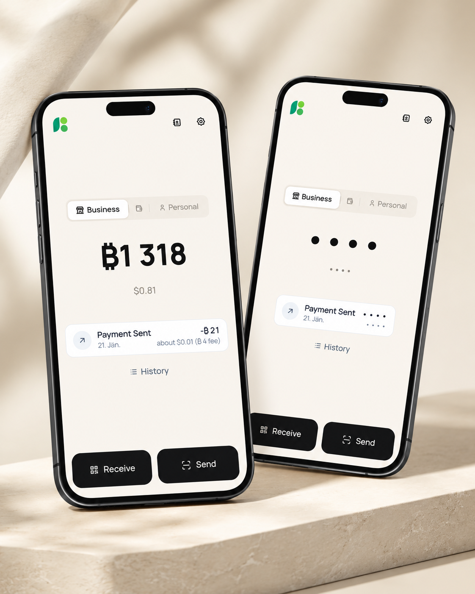
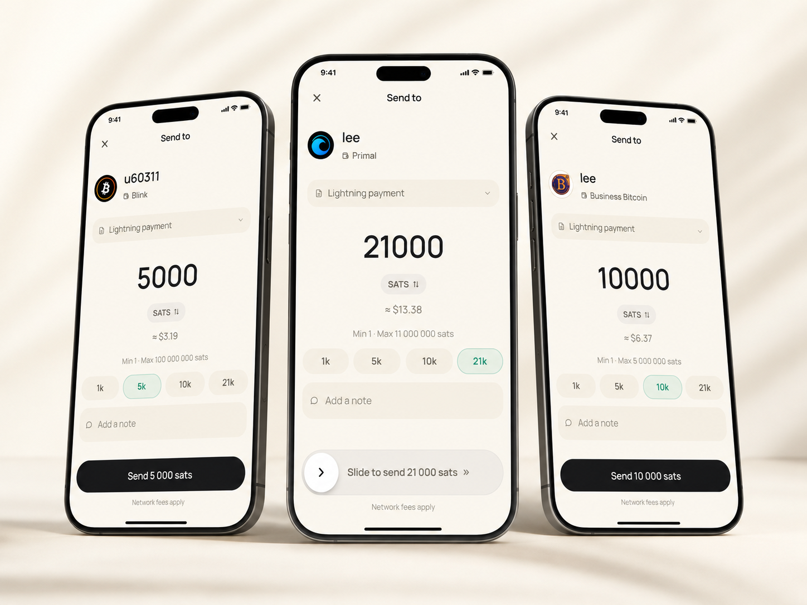
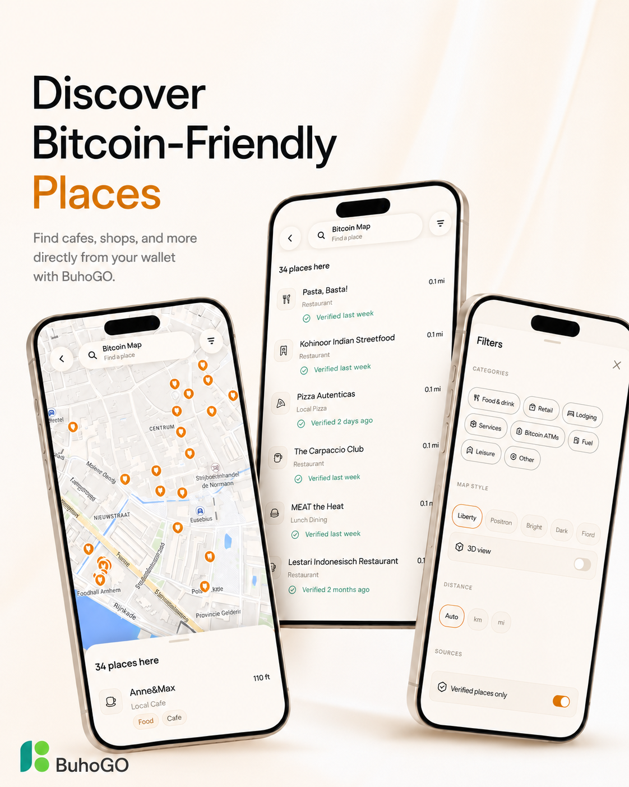
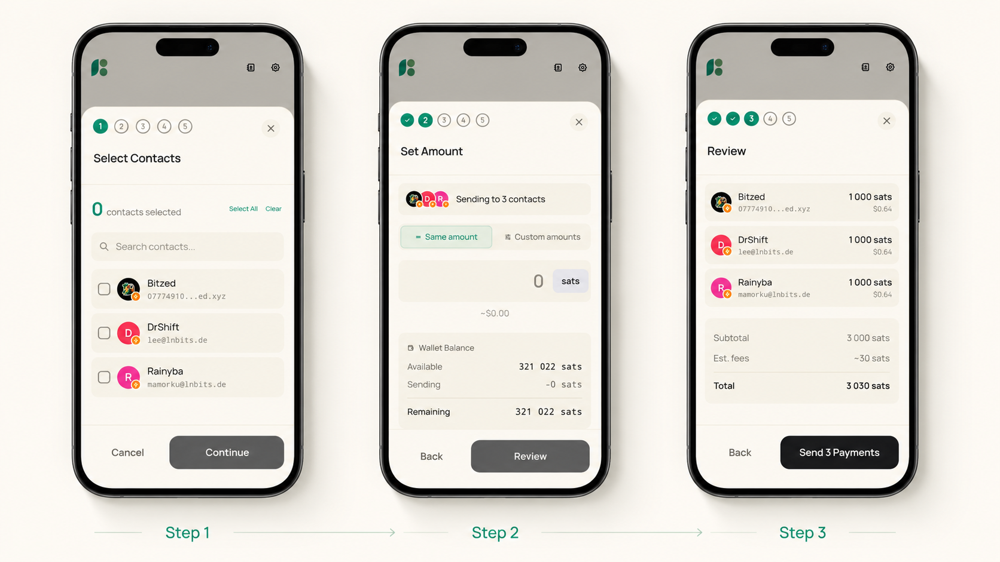
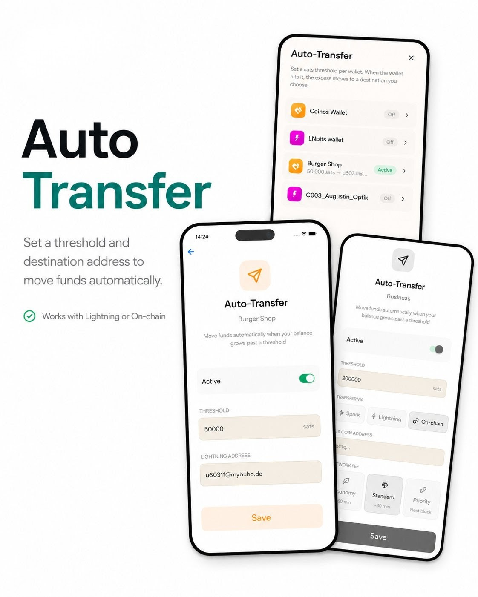
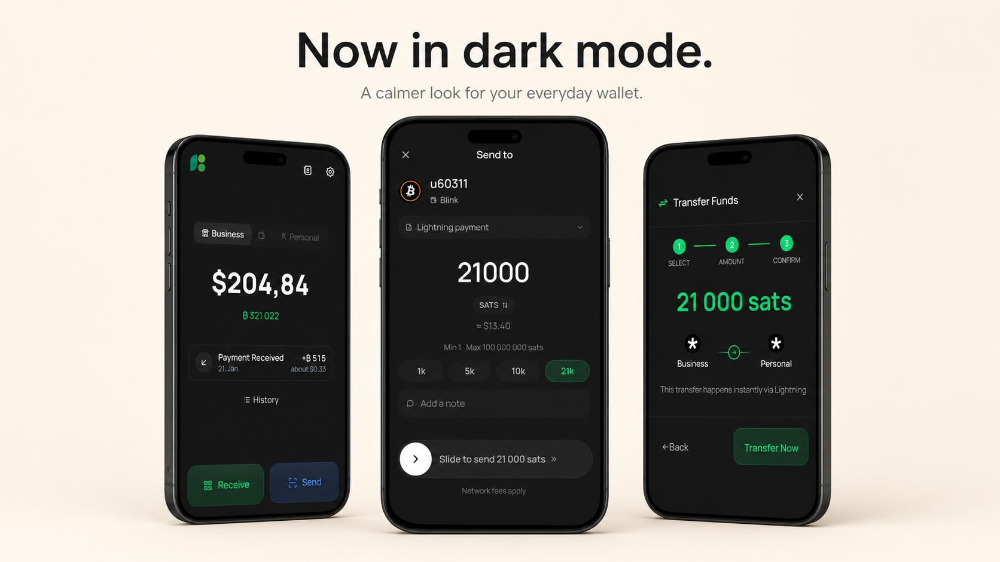

# BuhoGO

**The friendly Bitcoin wallet. Hold your own keys, pay anyone, spend anywhere.**

[**Open the app**](https://go.mybuho.de) · [**User Guide**](Guide.md) · [**Use Cases**](USE_CASES.md) · [**Developers**](Developer.md) · [**Contribute**](CONTRIBUTING.md)

 

## Why people use BuhoGO

BuhoGO is a Bitcoin and Lightning wallet that gets out of your way.

- **Start in seconds.** Create a self-custodial wallet, or connect one you already have. No sign-up, no email, no ID check.
- **Pay almost anything.** A Lightning invoice, a Lightning address, a Bitcoin address, a Nostr profile, even a phone number.
- **Spend in the real world.** Find cafes and shops that take Bitcoin right from the map inside the app.
- **Learn as you go.** Answer short Bitcoin questions and earn real sats while you do.

No one holds your money but you.

## Three ways to hold your sats

One app, three kinds of wallet. Use as many as you like, side by side.

| Wallet | Who holds the keys | Great for |
| --- | --- | --- |
| **Spark** | You (self-custody) | Newcomers who want true ownership plus on-chain Bitcoin |
| **NWC** | Your existing wallet (Alby, Primal, and others) | Keeping the Lightning wallet you already love |
| **LNBits** | Your own server | Power users running their own node |

> [!TIP]
> Spark is the easiest place to start. It gives you on-chain Bitcoin deposits and withdrawals, plus instant, zero-fee transfers to other Spark users, with no channel management to think about.

Not sure which to pick? The [User Guide](Guide.md) compares them in plain language.

## Pay anyone, anywhere

- Lightning invoices, Lightning addresses, LNURL pay and withdraw
- On-chain Bitcoin, send and receive (Spark)
- Instant, zero-fee Spark to Spark transfers
- Send to a **Nostr** profile, by npub or NIP-05 name
- Send to a **phone number** in Kenya and Zambia
- BuhoGO recognises who you are paying (Blink, Primal, Phoenix, Strike, and more) and shows their logo, so you can double check before you send
- **Branta verified** destinations confirm the money is going where you expect

## Find places that take Bitcoin

Open the map to discover cafes, shops, and services near you that accept Bitcoin. Search, filter, and pay straight from your wallet.

## Learn Bitcoin, earn real sats

A short, friendly course built right into the app. Work through bite-size questions about Bitcoin and Lightning, earn one sat for every correct answer, and claim them straight to your wallet. Learning that pays you back.

## Built for business

  

- **Kiosk Mode** turns any phone or tablet into a PIN-locked point-of-sale terminal, with tips, round-up, and fiat display. Staff only ever see the keypad.
- **Batch Send** pays many people in one guided flow, with progress for each.
- **Auto-Transfer** sweeps funds to a safe destination whenever your balance crosses a threshold. Works with Lightning and on-chain.
- **Internal Transfer** moves money between your own wallets.
- **Address Book** keeps your contacts and their Lightning, Spark, or Bitcoin addresses in one place.

## Now in dark mode

A calmer look for your everyday wallet. Switch any time in Settings, along with your language (English, German, Spanish) and biometric unlock.

## Your keys, your coins

Your wallet lives on your device, not on our servers. Self-custodial seeds are encrypted on the phone and never leave it. Connection details for NWC and LNBits are stored locally only. We cannot see your balance, freeze your funds, or hand them to anyone. Back up your seed phrase and you are in full control.

## Get BuhoGO

| Platform | Where |
| --- | --- |
| **Web app** | [go.mybuho.de](https://go.mybuho.de) |
| **Android** | [Google Play](https://play.google.com/store/apps/details?id=mybuho.buhogo) |
| **Self-host** | [Docker image](https://hub.docker.com/r/robinvonmises/buho_go) |

Want to build it yourself or run your own copy? The [Developer Guide](Developer.md) walks you through it.

## Documentation

| Doc | Read this to... |
| --- | --- |
| [**User Guide**](Guide.md) | Set up a wallet, send, receive, run a kiosk |
| [**Use Cases**](USE_CASES.md) | Follow real "I want to do X" walkthroughs |
| [**Developer Guide**](Developer.md) | Understand the architecture and build the app |
| [**Contributing**](CONTRIBUTING.md) | Help out, from fixing a typo to shipping a feature |

## License

[AGPL-3.0](LICENSE). Built for Bitcoiners, by Bitcoiners. 🦉
</content>
</invoke>
