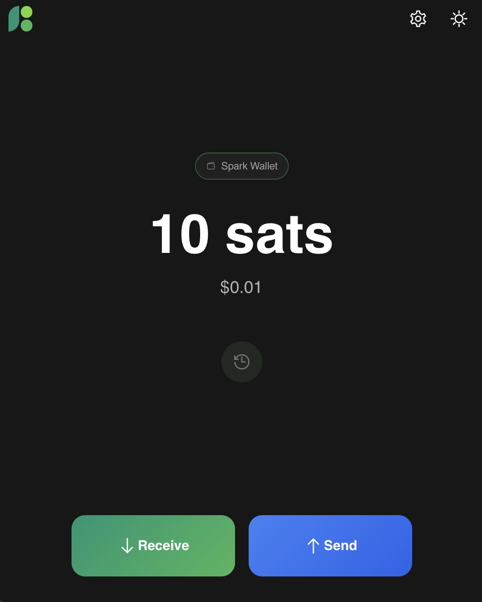
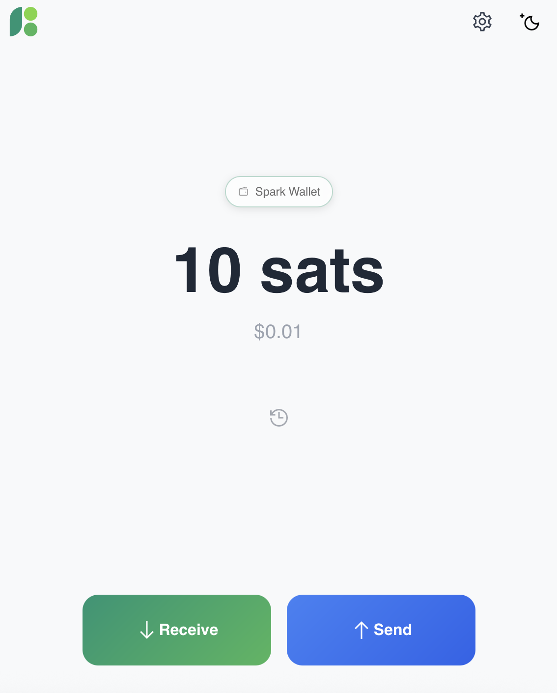
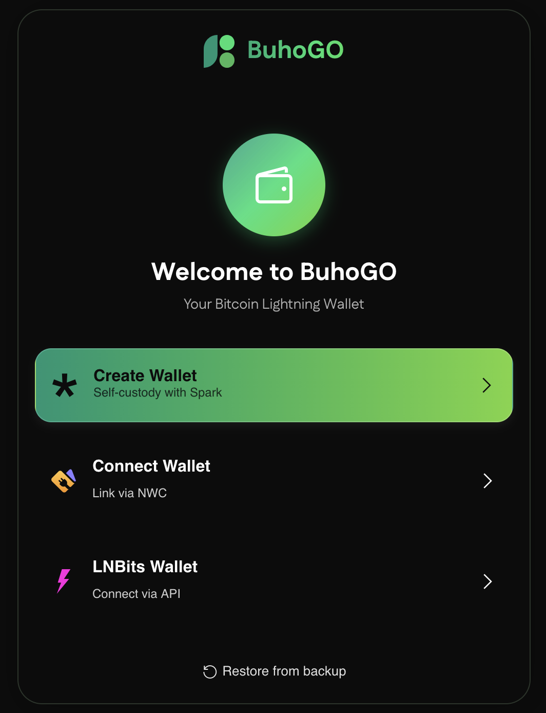
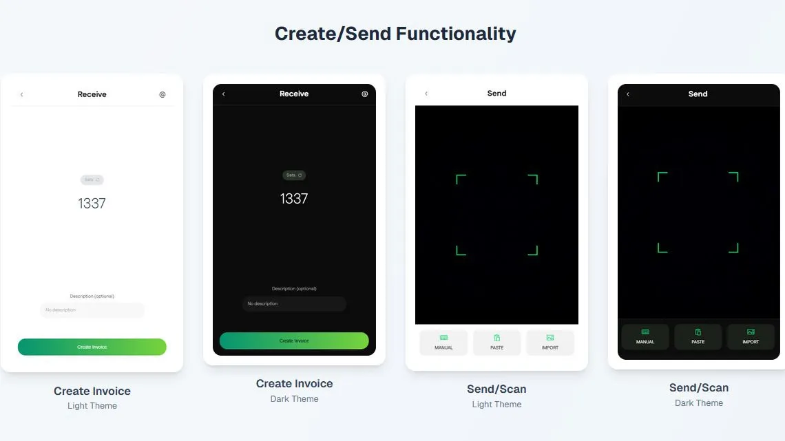
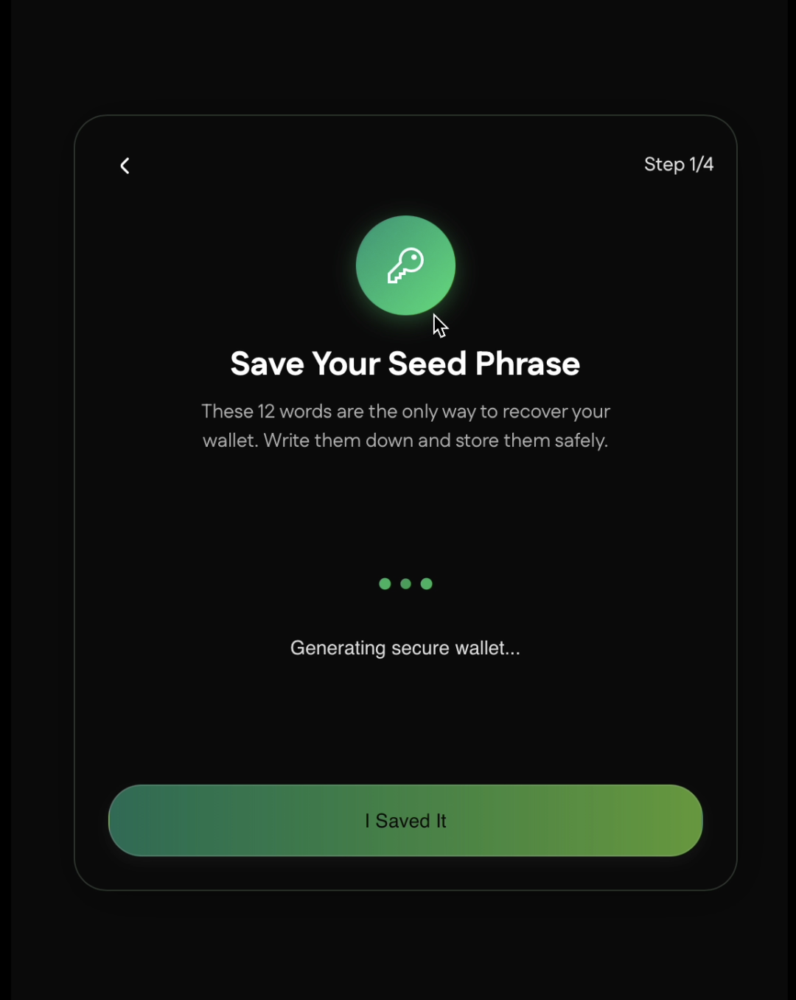
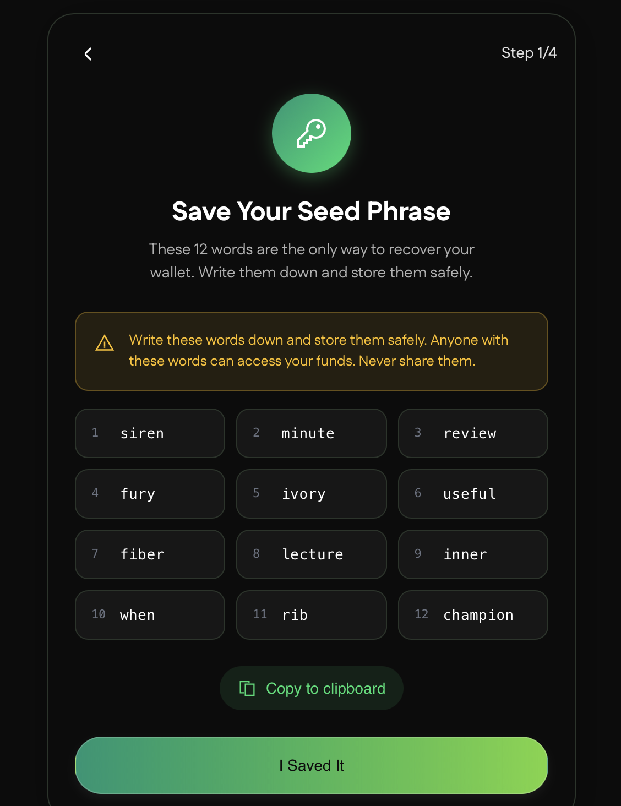
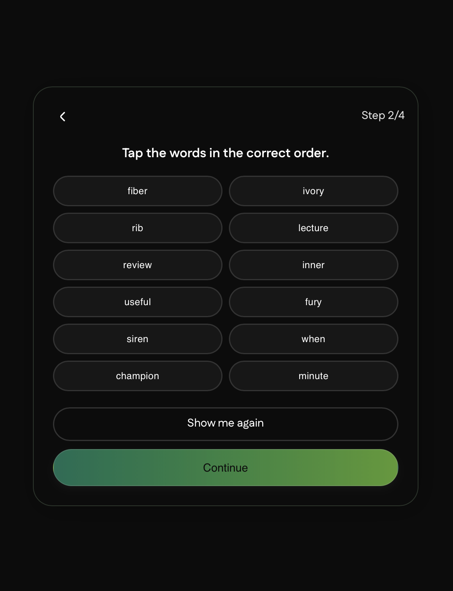
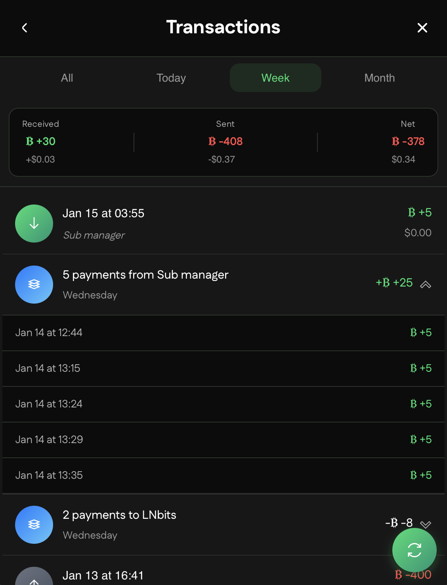
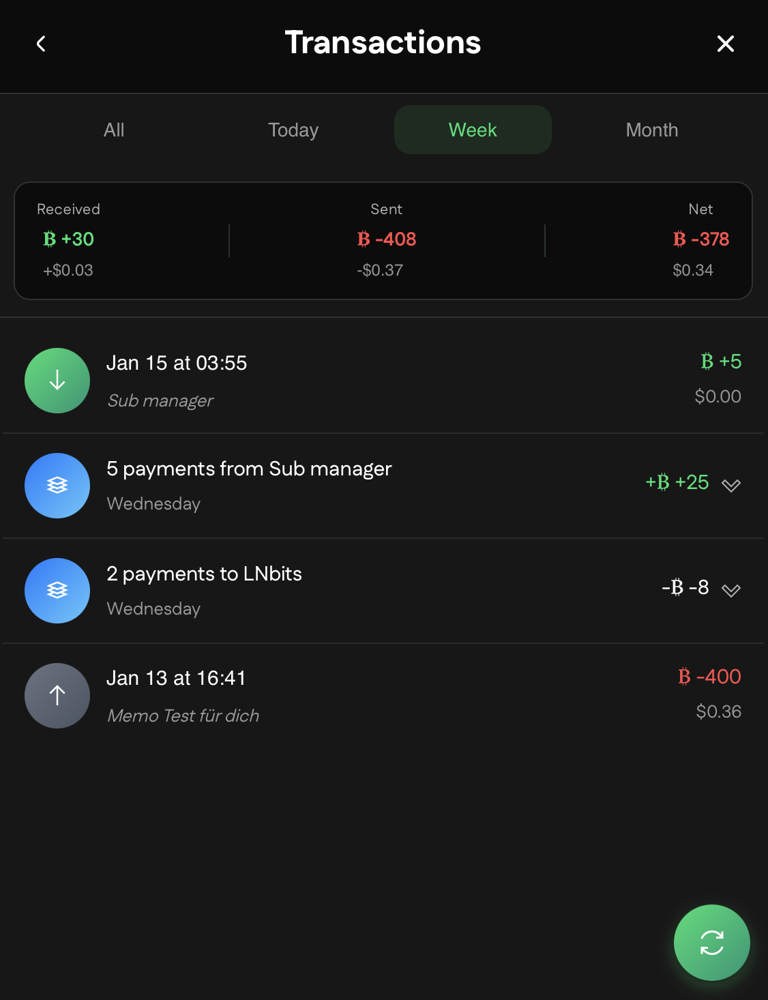

# BuhoGO

**Bitcoin & Lightning Wallet for Web and Mobile**

BuhoGO is an open-source wallet application that makes Bitcoin & Lightning payments accessible to everyone. Whether you prefer self-custody with [Spark](https://spark.money), connecting your existing wallet via [NWC](https://nwc.dev), or running your own [LNBits](https://lnbits.com) instance, BuhoGO provides a clean interface for everyday Bitcoin transactions.

[Live App](https://go.mybuho.de) | [Google Play](https://play.google.com/store/apps/details?id=mybuho.buhogo) | [Report Issues](https://github.com/Buho-Ecosystem/Buho_go/issues)


<br>

## Features

### Three Wallet Options

**Spark Wallet (Self-Custodial)**
- Generate a new wallet with 12-word seed phrase
- Full control over your Bitcoin with device-key encryption
- Zero-fee instant transfers to other Spark users
- On-chain Bitcoin (L1) deposits and withdrawals
- Business and Personal accounts from one seed

**NWC Connected Wallet**
- Connect any Nostr Wallet Connect compatible wallet
- Use your existing Lightning setup (Alby, Primal, etc.)
- Multiple NWC wallets supported simultaneously
- No seed phrase management required

**LNBits Wallet**
- Connect to any LNBits instance
- Full wallet control via Admin API key
- Multiple LNBits wallets supported
- Works with self-hosted and shared servers

### Payment Capabilities

| Feature | Spark | NWC | LNBits |
|---------|-------|-----|--------|
| Pay Lightning Invoices | Yes | Yes | Yes |
| Pay Lightning Addresses | Yes | Yes | Yes |
| Pay LNURL Requests | Yes | Yes | Yes |
| Receive Lightning | Yes | Yes | Yes |
| Spark-to-Spark Transfers | Yes | No | No |
| Zero-Fee Transfers | Yes | No | No |
| On-Chain Bitcoin (L1) | Yes | No | No |

### Kiosk Mode (Point of Sale)

Turn any device into a dedicated payment terminal.

- PIN-locked POS interface for employees
- Configurable tip percentages (5%, 10%, 20%)
- Round-up option for whole number amounts
- Sats or fiat display currency
- Destination wallet selection
- Deep link blocking while locked

### Additional Features

- **QR Scanner**: Scan invoices, addresses, and LNURL codes
- **Address Book**: Save contacts with Lightning, Spark, or Bitcoin addresses
- **Batch Send**: Pay multiple contacts in one go
- **Internal Transfer**: Move funds between your wallets
- **Auto-Transfer**: Threshold-based automatic payouts to any destination
- **Transaction History**: Full record with notes, tags, and contact linking
- **Deep Links**: Handle `lightning:`, `bitcoin:`, `lnurlp://`, and `lnurlw://` URIs
- **Biometric Auth**: Fingerprint or face unlock on mobile
- **Dark and Light Themes**: Choose your preferred appearance
- **Multi-Language**: English, German, Spanish
- **Real-Time Prices**: Bitcoin price display in your preferred currency

<br>

## Screenshots

### Interface Themes

 

### Welcome Screen



### Send and Receive



### Spark Wallet Setup

  

### Transaction History

 

<br>

## Quick Start

### Installation

```bash
git clone https://github.com/Buho-Ecosystem/Buho_go.git
cd Buho_go
npm install
npm run dev
```

The app will be available at `http://localhost:9000`

### Production Build

```bash
npm run build
```

Build output goes to `dist/spa`.

### Android Build

```bash
quasar build -m capacitor -T android
```

Or use `--ide` to open in Android Studio for debugging.

<br>

## Getting Started

For detailed step-by-step instructions, see the [User Guide](Guide.md).

### Option A: Create a Spark Wallet

1. Open the app and select "Create Wallet"
2. Write down your 12-word seed phrase (this is your backup)
3. Verify your backup by tapping words in the correct order
4. Your wallet is ready with Business and Personal accounts

See [Setting Up a Spark Wallet](Guide.md#setting-up-a-spark-wallet) for details.

### Option B: Connect an NWC Wallet

1. Open the app and select "Connect Wallet"
2. Get your NWC connection string from your wallet provider
3. Paste the string or scan the QR code
4. Your wallet is now connected

See [Connecting an NWC Wallet](Guide.md#connecting-an-nwc-wallet) for details.

### Option C: Connect an LNBits Wallet

1. Open the app and select "Connect Wallet" then "LNBits"
2. Enter your server URL and Admin API key
3. Your wallet is now connected

See [Connecting an LNBits Wallet](Guide.md#connecting-an-lnbits-wallet) for details.

### Making Payments

BuhoGO accepts multiple payment formats:

- **Lightning Invoice**: Strings starting with `lnbc...`
- **Lightning Address**: Email-like format `name@domain.com`
- **LNURL**: Encoded payment requests starting with `lnurl...`
- **Spark Address**: Strings starting with `spark1...` (Spark wallets only)
- **Bitcoin Address**: On-chain addresses like `bc1p...` or `bc1q...` (Spark wallets only)

Scan a QR code or paste the payment destination and the app handles the rest.

<br>

## Security

For technical details, see the [Developer Guide](Developer.md#security-considerations).

### Spark Wallet Security

- Seed phrases encrypted with AES-256-GCM using a device key
- Private keys never leave your device
- No server-side storage of sensitive data
- Biometric unlock available on mobile

### NWC / LNBits Wallet Security

- Connection strings and API keys stored locally only
- Each wallet operates independently
- Non-custodial architecture throughout

### Best Practices

- Back up your Spark seed phrase securely offline
- Verify recipient addresses before sending
- Start with small amounts when testing

<br>

## Tech Stack

For architecture details, see the [Developer Guide](Developer.md#architecture-overview).

| Component | Technology |
|-----------|------------|
| Framework | Vue.js 3 |
| UI Library | Quasar Framework |
| State Management | Pinia |
| Build Tool | Vite |
| Lightning (Spark) | @buildonspark/spark-sdk |
| Lightning (NWC) | @getalby/sdk |
| Lightning (LNBits) | LNBits REST API |
| Mobile | Capacitor (Android, iOS planned) |

<br>

## Project Structure

```
src/
  boot/              # App initialization (safe-area, deep-links, kiosk, i18n)
  components/        # Reusable Vue components
  css/               # Global styles and theming
  i18n/              # Internationalization (en, de, es)
  pages/             # Application pages/routes
  providers/         # Wallet provider implementations
  router/            # Vue Router configuration
  stores/            # Pinia state stores
  utils/             # Shared utilities
```

<br>

## Documentation

- [User Guide](Guide.md) - Step-by-step instructions for using BuhoGO
- [Use Cases](use_cases.md) - Real-world scenarios and examples
- [Developer Guide](Developer.md) - Technical documentation for contributors

<br>

## Contributing

Contributions are welcome. Please read the [Developer Guide](Developer.md) before contributing.

1. Fork the repository
2. Create a feature branch
3. Make your changes following the [Styling Guidelines](Developer.md#styling-guidelines)
4. Submit a pull request

<br>

## License

AGPL-3.0. See [LICENSE](LICENSE) for the full text.

<br>

## Links

- **Web App**: [go.mybuho.de](https://go.mybuho.de)
- **GitHub**: [Buho-Ecosystem/Buho_go](https://github.com/Buho-Ecosystem/Buho_go)
- **Google Play**: [BuhoGO](https://play.google.com/store/apps/details?id=mybuho.buhogo)
- **Docker Image**: [BuhoGO Docker](https://hub.docker.com/r/robinvonmises/buho_go)

<br>

*Built for the Bitcoin community by people who use Bitcoin every day.*
