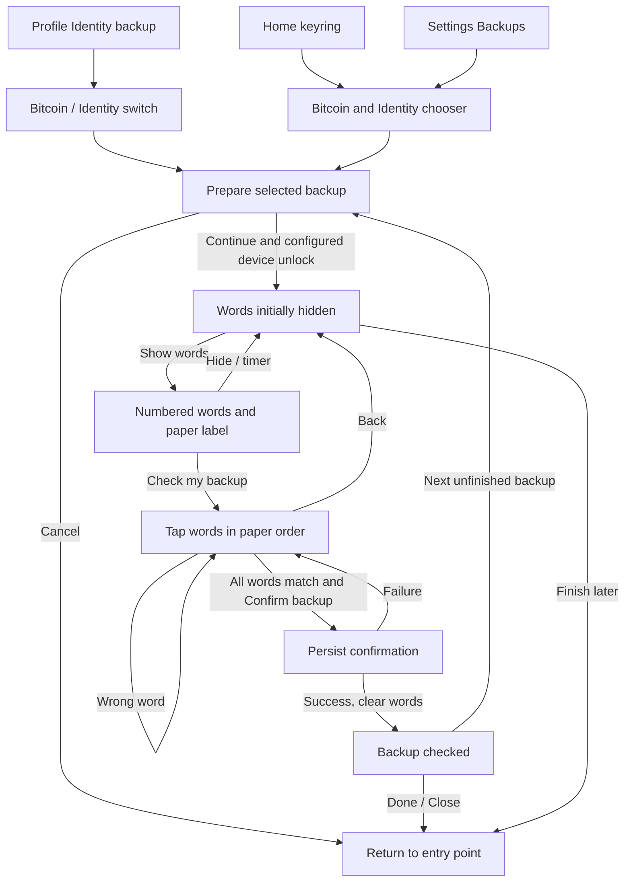
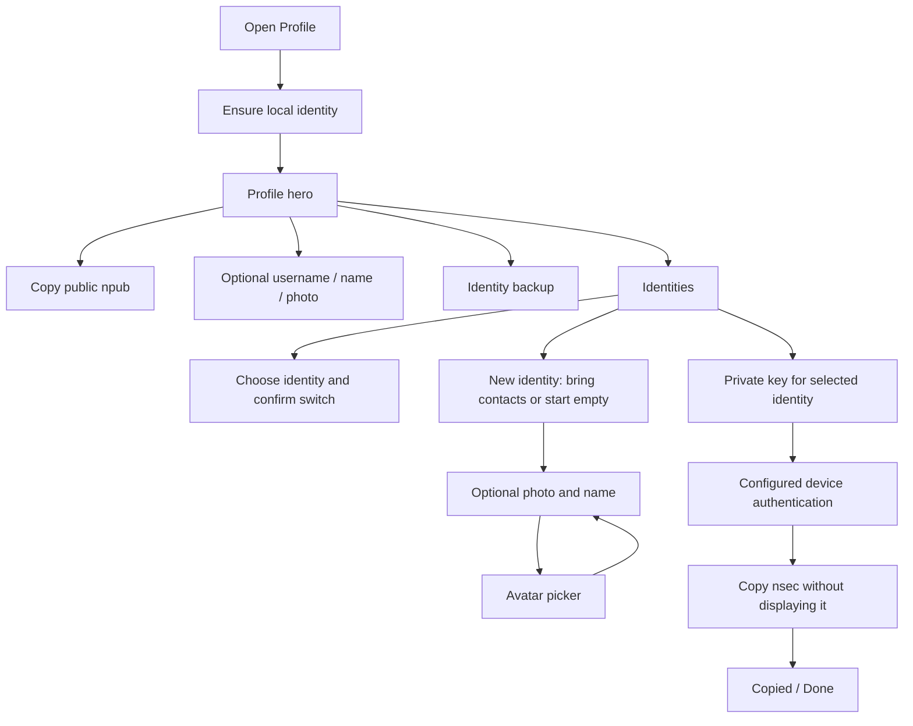
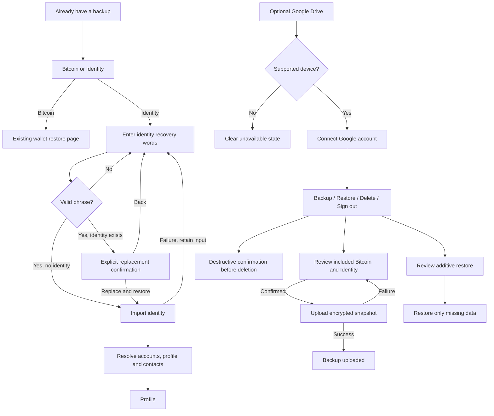

# Bitcoin and identity recovery

## Scope and design sources

This redesign applies Apple HIG and Nostr Design to BuhoGO's existing Vue/Quasar/Capacitor architecture. These are the only external design sources. The choices below are app-specific applications of their guidance; a web UI does not become a native UIKit control simply by resembling one.

| Primary source | Application in BuhoGO |
| --- | --- |
| [Apple: Segmented controls](https://developer.apple.com/design/human-interface-guidelines/segmented-controls) | Two equal segments, **Bitcoin / Identity**, switch closely related views in place. Both retain a clear selection and separate status. Labels are nouns; selecting a segment does not launch a dialog. |
| [Apple: Sheets](https://developer.apple.com/design/human-interface-guidelines/sheets) and [Modality](https://developer.apple.com/design/human-interface-guidelines/modality) | One focused task at a time. Choosers finish dismissing before opening the next sheet. The longer paper-backup task uses a full-screen modal on narrow phones. |
| [Apple: Onboarding](https://developer.apple.com/design/human-interface-guidelines/onboarding) | Contextual preparation and an optional next backup, with a way to leave each stage. The initial wallet tour explains the two backup types briefly. |
| [Apple: Accessibility](https://developer.apple.com/design/human-interface-guidelines/accessibility) and [Design tips](https://developer.apple.com/design/tips/) | Labels plus checkmarks, visible keyboard focus, controls at least 44 CSS pixels high, reflow, light/dark themes, and no color-only backup status. |
| [Apple: Writing](https://developer.apple.com/design/human-interface-guidelines/writing) and [Alerts](https://developer.apple.com/design/human-interface-guidelines/alerts) | Concrete actions, short contextual errors, and explicit identity-replacement confirmation immediately before replacement. |
| [Nostr: Onboarding](https://nostrdesign.org/docs/how-to/onboarding/) | Reveal concepts when they become relevant. Profile use and optional personalization remain available before backup completion. |
| [Nostr: Private key safeguarding](https://nostrdesign.org/docs/how-to/private-key-safeguarding/) | Never render an `nsec`, even partially. A named identity's private-key sheet explains the consequence and offers deliberate copying. The public `npub` belongs on the shareable profile hero. |
| [Nostr: Error handling](https://nostrdesign.org/docs/how-to/error-handling/) | Wrong-word feedback names the paper position without exposing the answer. Failed storage/authentication/upload stays recoverable in context. Native configuration details stay in diagnostics. |
| [Nostr: Starting from scratch](https://nostrdesign.org/docs/design-principles/starting-from-scratch/) | Map the complete journeys and share repeated components instead of maintaining separate wallet and identity verification implementations. |

The colored keyring comes from the user's Wallet of Satoshi reference. Disabling the home backup banner and Settings attention strip is also an explicit product decision from the user. Both mounts remain commented in their original pages, and their implementations remain available.

## What each backup means

| User-facing subject | Actual recovery scope | Confirmation state |
| --- | --- | --- |
| Bitcoin — Personal / Business | Spark accounts share one phrase. User wallet names are prominent; Spark is supporting text. | All Spark metadata flags, plus the legacy Spark flag, after durable storage succeeds. |
| Bitcoin — another local wallet | Each Arkade wallet has its own phrase. User name first; Arkade is supporting text. | Only the chosen wallet. |
| Identity | One identity phrase derives all local Nostr identity accounts. Profile and contacts are recovered from their existing Nostr storage. | `identity.backupConfirmed`, after metadata persistence succeeds. |
| Connected wallet | NWC/LNbits recovery belongs to the provider; there is no invented local phrase. | Does not participate in phrase verification. |
| Optional Google Drive copy | Existing encrypted snapshot of wallet credentials and the identity seed on supported Android builds. | Upload time remains separate from paper-word verification. An old snapshot is not proof that today's keys are covered. |

**Bitcoin** and **Identity** are two recovery families, not necessarily exactly two phrases: Spark plus Arkade requires separate Bitcoin backups. A manual phrase is labeled with its provider/identity scope on the write stage. The selected wallet ID is pinned before loading words, so changing the active wallet cannot silently redirect a backup.

An `nsec` is a single account's raw private key. The paper flow is a separate, explicitly requested mnemonic recovery task. Its reveal control is not an `nsec` preview. Copying a private key never marks a recovery phrase checked, and exporting an inactive identity never switches the active profile or signer.

## Entry points and screen inventory

| Surface | Destination / behavior |
| --- | --- |
| Wallet home | Persistent colored keyring. Pending label is Bitcoin & identity, Bitcoin, or Identity. Once all existing phrases are checked, only the keyring remains. |
| Home backup banner | Mount commented out in `Wallet.vue`; component retained with shared keyring. |
| Settings attention strip | Mount commented out in `Settings.vue`; reminder implementation retained. Destructive-action warnings remain. |
| Settings → Security → Backups | Common chooser with Bitcoin and Identity sections, each showing its own state. |
| Settings → Google Drive backup / Restore | Existing optional Android integration; shared keyring and contextual retry. |
| Profile hero | Copy public key with inline confirmation; name/photo editing, code flip, identity switching, and existing pending-backup link remain. Hidden card face is inert to keyboard/accessibility focus. |
| Profile → Identity backup | Canonical identity-backup entry. Opens the Bitcoin / Identity switch with Identity selected. |
| Profile setup ladder | Identity backup step leads to the same destination. Completed setup remains optional to revisit. |
| Profile → Identities | Current identity, other identities, create/switch, and per-identity Private key actions. Removed duplicate phrase-backup row. |
| Former Keys page | Removed; legacy `/identity/advanced` redirects to Identities. No competing key-management screen. |
| Per-identity private-key sheet | Selected identity name and shortened public key; short privacy explanation; Copy private key; device authentication when configured; copied confirmation / inline retry. No secret in DOM or reactive state. |
| Backup page → Bitcoin segment | User-named wallet groups with small provider captions and checked state; selecting a group starts its backup/view task. |
| Backup page → Identity segment | Name/photo/contacts scope and one Back up identity or View recovery words action. |
| Backup page → Restore from recovery words | Identity / Bitcoin chooser; dismissal precedes navigation or the restore dialog. |
| Shared recovery modal | Prepare → Write → Check → Done, or Prepare → View for already-checked words. Detailed states below. |
| Identity restore modal | Enter words → validate → replacement confirmation when an identity exists → apply → existing profile/contact recovery. Cancel preserves current identity. Failed restore retains input for correction. |
| Wallet restore page | Existing mnemonic validation and provider restore, now marked with the shared keyring. |
| Welcome → existing wallet / Google Drive restore | Existing optional recovery entry points retained. The paper-restore entry uses the shared keyring. |
| Wallet success tour | Short two-backup explanation with the keyring; tour skipping and optional setup remain. |
| New identity flow | Choose contacts → create → optional photo/name setup. Creation, setup and avatar picker hand off after dismissal. Same phrase recovers the new identity. |
| Identity erase | Existing explicit destructive confirmation retained; wallet independence and recovery requirements remain relevant here. |
| Other profile/username/share/get-paid/sign-in screens | Existing tasks and recovery/publishing services remain connected to the same identity. They do not independently mark a backup complete. |

## Manual backup state map

- The subject stays visible throughout the modal. Wallet and identity preparation use the same lifecycle and verifier.
- A wrong word never reveals the expected word. All positions must match before confirmation is offered.
- Closing/backgrounding clears displayed words and the verification grid. A hidden preparation/authentication stage may finish loading but never reveals words automatically.
- The reveal timer uses wall-clock elapsed time. View-only access does not alter backup state.
- Failed canonical persistence rolls back optimistic flags and keeps the check retryable. A failed legacy cache write does not undo an already durable canonical write.
- Completion offers the next unfinished phrase, starting a fresh preparation stage; the user can finish for now instead.

## Identity setup and keys

The private-key store action accepts a validated roster account and pins it across decryption. The sheet also rejects stale requests when its subject changes or it closes. The existing sensitive-clipboard helper schedules a best-effort clear that survives closing the sheet; the UI does not promise OS-level clipboard deletion.

## Restore and optional Google Drive

Google backup is optional and uses the existing native implementation. It does not mark paper words checked. See [Cloud backup setup](CLOUD_BACKUP_SETUP.md) for transport/encryption behavior and Android configuration.

## Code organization

- `BackupKeyring.vue`: single reusable asset wrapper.
- `BackupCoverage.vue`: independent status plus an opt-in keyboard-accessible tab selector.
- `BackupsSheet.vue`: chooser and dismissal-based handoff.
- `RecoveryPhraseDialog.vue`: subject-specific copy and store adapters.
- `useRecoveryPhraseFlow.js`: shared asynchronous lifecycle, timer and cleanup.
- `MnemonicOrderVerify.vue`: paper-copy verification and actionable feedback.
- Legacy wallet/identity dialog components are thin compatibility wrappers.
- `IdentityPrivateKeySheet.vue`: account-scoped copy-only export.
- `backupStatus.js`: wallet grouping and user-first names.
- Locale additions are grouped in each locale's `backup.js`.

## Validation

Run the existing unit suite with `npm test` and production compilation with `npm run build`.

With the local Quasar dev server on port 9000, run `node scripts/backup-experience.mjs`. It uses public BIP-39 test words, blocks provider connections, and mocks the Google transport. No real wallet, identity, or Google backup is modified. Screenshots go to the ignored/untracked output folder.

Coverage includes separate Spark/Arkade/identity confirmation, wrong-word retry, failed durable wallet save and retry, hidden-word DOM, cancellation/backgrounding, next-backup transitions, persistent home icon, disabled banners, Bitcoin/Identity keyboard switching, public/private copying, identity-restore confirmation, optional cloud upload retry, and English/German/Spanish narrow layouts. Store regressions cover identity confirmation rollback and exporting an inactive account without switching.

Native biometrics/PIN, Android Google consent/upload/restore, real VoiceOver/TalkBack, and actual provider recovery still require device acceptance testing. Browser checks do not certify those platform behaviors or guarantee recovery of profile data unavailable from its Nostr relays.
